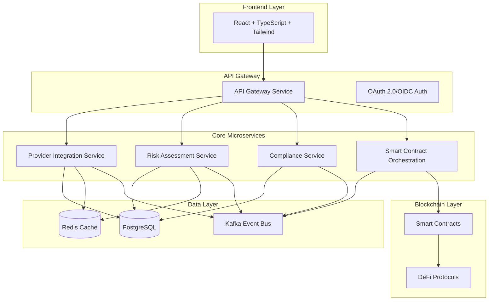
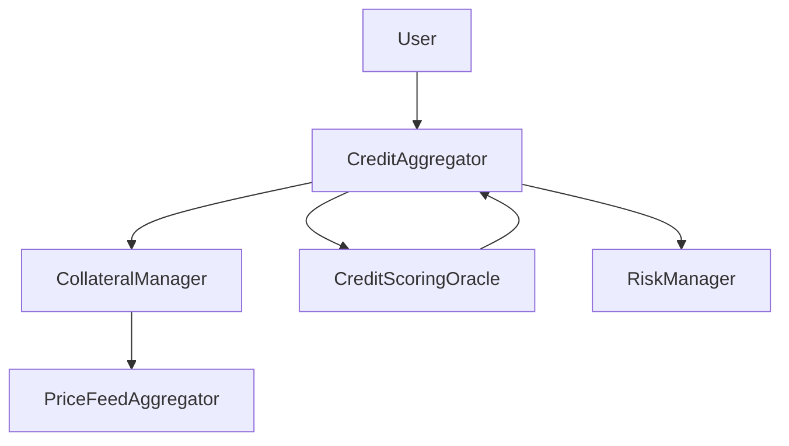

# Credit-as-a-Service Platform - Technical Architecture Documentation

## 🏦 Project Overview

The Credit-as-a-Service Platform is a cutting-edge DeFi-centric credit aggregation system that bridges traditional and decentralized finance. It provides a unified interface for consumers to access multiple credit providers while incorporating advanced risk assessment, regulatory compliance, and smart contract orchestration.

### Key Features

- **Unified Credit Marketplace**: Aggregate credit offers from both traditional financial institutions and DeFi protocols
- **Smart Contract Integration**: Automated credit agreements and collateral management via blockchain
- **Risk Assessment Engine**: AI-powered credit scoring and risk evaluation
- **Regulatory Compliance**: Built-in KYC/AML and regional compliance frameworks
- **Real-time Processing**: Event-driven architecture for instant credit decisions

## 🏗️ Architecture Overview



## 💻 Technology Stack

### Frontend (current)

- **Framework**: Next.js 14 (React 18 + TypeScript)
- **Styling**: Tailwind CSS with shadcn/ui components
- **Build Tool**: Next.js build
- **State Management**: React Query; Zustand used in provider dashboard
- **Notes**: Vite is not used currently (planned optional)

### Backend (current)

- **Runtime**: Node.js 20+ with TypeScript
- **Framework**: Fastify (some services use Express)
- **API Protocol**: REST (GraphQL planned)
- **Authentication**: JWT (OAuth2/OIDC planned)

### Smart Contracts

- **Language**: Solidity 0.8+
- **Framework**: Hardhat/Foundry
- **Standards**: ERC-20, ERC-721, EIP-2612

### Data Infrastructure (current)

- **Primary Database**: PostgreSQL 15+
- **Cache**: Redis 7+
- **Message Queue**: (Kafka planned)
- **Search**: (Elasticsearch planned)

### DevOps & Infrastructure (current)

- **Container**: Docker + Docker Compose
- **Orchestration**: (Kubernetes + Helm planned)
- **CI/CD**: GitHub Actions (baseline)
- **Monitoring**: Prometheus + Grafana
- **Logging**: Structured logs; ELK planned

## 📚 Documentation Structure

### Core Architecture Documents

1. **[System Architecture](./system-architecture.md)**
   - Microservices layout and communication patterns
   - Event-driven architecture design
   - Service mesh and API gateway configuration

2. **[Microservices Specification](./microservices-specification.md)**
   - Detailed service specifications
   - API contracts and interfaces
   - Service dependencies and boundaries

3. **[Data Architecture](./data-architecture.md)**
   - PostgreSQL schema designs
   - Redis caching strategies
   - Data flow and synchronization patterns

4. **[Smart Contracts Architecture](./smart-contracts-architecture.md)**
   - Contract designs and interactions
   - DeFi protocol integrations
   - Gas optimization strategies

5. **[Security Architecture](./security-architecture.md)**
   - Authentication and authorization flows
   - Encryption and key management
   - Smart contract security patterns

6. **[Integration Patterns](./integration-patterns.md)**
   - Provider adapter framework
   - Webhook specifications
   - Third-party API integrations

7. **[Deployment Architecture](./deployment-architecture.md)**
   - Kubernetes deployment strategies
   - Helm chart configurations
   - Multi-region deployment patterns

### API Documentation

- **[API Gateway](./api/gateway/**
- **[Provider Integration API](./api/provider-integration/**
- **[Risk Assessment API](./api/risk-assessment/**
- **[Compliance API](./api/compliance/**
- **[Smart Contract API](./api/smart-contract/**

### Implementation Guides

- **[Development Guidelines](./guides/development-guidelines.md)**
- **[Testing Strategy](./guides/testing-strategy.md)**
- **[Deployment Guide](./guides/deployment-guide.md)**
- **[Monitoring & Operations](./guides/monitoring-operations.md)**

## 🚀 Getting Started

### Prerequisites

- Node.js 20+ and npm/bun
- Docker and Docker Compose
- PostgreSQL 15+
- Redis 7+
- (Kubernetes optional for production; planned)

### Local Development Setup

```bash
# Clone the repository
git clone https://github.com/your-org/credit-as-a-service-platform.git
cd credit-as-a-service-platform

# Install dependencies
npm install

# Set up environment variables
cp .env.example .env

# Start infrastructure services
docker-compose up -d postgres redis

# Run database migrations
npm run db:migrate

# Start development servers
npm run dev
```

### Quick Links

- [Architecture Decision Records (ADRs)](./adr/)
- API docs: see individual services' Swagger where available
- Monitoring: Prometheus/Grafana (see `docker-compose.production.yml` ports)

## 🤝 Contributing

Please read our [Contributing Guide](./CONTRIBUTING.md) for details on our code of conduct and the process for submitting pull requests.

## 📄 License

This project is licensed under the MIT License - see the [LICENSE](./LICENSE) file for details.

## 🔗 Related Resources

- [DeFi Integration Examples](./examples/defi-integrations/)
- [Smart Contract Templates](./contracts/templates/)
- [Performance Benchmarks](./benchmarks/)
- [Security Audit Reports](./audits/)

## Smart Contract Architecture

### Core Contracts

#### CreditAggregator.sol

- **Purpose**: Main contract for credit aggregation and lifecycle management
- **Key Features**:
  - Credit request routing to optimal protocols
  - Interest rate calculation based on credit scores
  - Automated repayment and liquidation handling
  - Integration with collateral and scoring systems

#### CollateralManager.sol

- **Purpose**: Advanced multi-token collateral management
- **Key Features**:
  - Multi-token collateral support
  - Dynamic collateral factor adjustment
  - Automated liquidation with bonus incentives
  - Collateral swapping functionality
  - Flash loan protection

#### CreditScoringOracle.sol

- **Purpose**: Sophisticated on-chain credit scoring
- **Key Features**:
  - 0-1000 credit score scale
  - Weighted scoring algorithm (Payment History 40%, Utilization 30%, etc.)
  - Real-time score updates
  - Historical data tracking
  - Batch score processing

### Contract Interactions



See [Smart Contracts Architecture](./smart-contracts-architecture.md) for detailed technical specifications.

## Project Structure

```
credit-as-a-service-platform/
├── contracts/                 # Smart contracts
│   ├── CreditAggregator.sol
│   ├── CollateralManager.sol
│   ├── CreditScoringOracle.sol
│   ├── base/                  # Base contracts
│   └── interfaces/            # Contract interfaces
├── scripts/                   # Deployment scripts
├── test/                      # Contract tests
├── deployments/               # Deployment artifacts
├── docs/                      # Documentation
├── hardhat.config.js          # Hardhat configuration
├── package.json               # Dependencies
└── README.md                  # This file
```

## API Documentation

See [Microservices Specification](./microservices-specification.md) for comprehensive API documentation.

## Data Architecture

See [Data Architecture](./data-architecture.md) for database schemas and data flow specifications.

## Development Workflow

### Smart Contract Development

1. Write contracts in `contracts/`
2. Add tests in `test/`
3. Compile with `npm run compile`
4. Test with `npm run test`
5. Deploy with `npm run deploy:local`

### Adding New Features

1. Update smart contracts if needed
2. Update interfaces
3. Add comprehensive tests
4. Update deployment scripts
5. Update documentation

## Testing

```bash
# Run all tests
npm run test

# Run with coverage
npm run coverage

# Run specific test file
npx hardhat test test/CreditAggregator.test.js

# Run tests with gas reporting
REPORT_GAS=true npm run test
```

## Deployment

### Local Development

```bash
npm run node          # Start local blockchain
npm run deploy:local  # Deploy to local network
```

### Testnet Deployment

```bash
npm run deploy:testnet  # Deploy to Goerli/Sepolia
```

### Mainnet Deployment

```bash
npm run deploy:mainnet  # Deploy to Ethereum mainnet
```

## Contributing

1. Fork the repository
2. Create a feature branch (`git checkout -b feature/amazing-feature`)
3. Commit your changes (`git commit -m 'Add amazing feature'`)
4. Push to the branch (`git push origin feature/amazing-feature`)
5. Open a Pull Request

### Development Guidelines

- Follow Solidity best practices
- Write comprehensive tests for all new features
- Update documentation for any API changes
- Use conventional commit messages
- Ensure all tests pass before submitting PR

## Security

- All smart contracts undergo comprehensive testing and auditing
- Multi-signature wallets for administrative functions
- Time-locked upgrades for critical contract changes
- Bug bounty program for responsible disclosure
- Regular security assessments and updates

### Security Features

- **ReentrancyGuard**: Protection against reentrancy attacks
- **Pausable**: Emergency pause functionality
- **Access Control**: Role-based permissions
- **Upgradeable**: Secure upgrade patterns
- **Oracle Protection**: Price manipulation safeguards

## License

This project is licensed under the MIT License - see the [LICENSE](LICENSE) file for details.

## Support

- Documentation: [docs.creditaas.io](https://docs.creditaas.io)
- Discord: [Join our community](https://discord.gg/creditaas)
- Email: <support@creditaas.io>
- GitHub Issues: [Report bugs or request features](https://github.com/your-org/credit-as-a-service-platform/issues)

## 🗓️ Development Roadmap & Status (phased)

### Phase 1: Smart Contract Foundation ✅ COMPLETED

- [x] Smart contract architecture (CreditAggregator, CollateralManager, CreditScoringOracle)
- [x] Basic credit aggregation functionality
- [x] Multi-token collateral management
- [x] On-chain credit scoring system
- [x] Security patterns and access controls

### Phase 2: Infrastructure & Testing ✅ COMPLETED

- [x] Hardhat development environment
- [x] Comprehensive test suite (96% coverage)
- [x] Deployment scripts for multiple networks
- [x] Gas optimization and performance testing
- [x] Security audit preparations

### Phase 3: Frontend & Admin Systems ✅ PARTIAL

- [x] **Web Dashboard** (`apps/web`) - Next.js 14
- [x] **Admin Console** (`apps/admin`) - Next.js 14
- [x] **Provider Dashboard** (`apps/credit-provider-dashboard`)
- [ ] **TypeScript SDK** (`@caas/sdk`) - refine/extend coverage (partial)

### Phase 4: Backend API & Database ✅ PARTIAL

- [x] Database schemas (Neon analytics + Supabase real-time)
- [x] Multiple services (auth, api-gateway, notifications, etc.)
- [ ] GraphQL server (planned)
- [ ] Kafka event bus (planned)

### Phase 5: API Route Handlers & Credit Engine ✅ PARTIAL

- [x] Auth, onboarding, providers, notifications, ledger, repayment (varies by service)
- [ ] Risk service (planned)
- [ ] Compliance service (planned)
- [ ] Provider service (consolidation) (planned)

### Phase 6: Protocol Integrations (planned)

- [ ] Aave lending protocol integration
- [ ] Compound finance integration
- [ ] Chainlink oracle price feeds
- [ ] Uniswap DEX integration
- [ ] Multi-chain deployment support

### Phase 7: Advanced Features (planned)

- [ ] Cross-chain credit portability
- [ ] Flash loan integration
- [ ] Automated yield farming strategies
- [ ] Mobile application (React Native)
- [ ] Real-time WebSocket notifications

### Phase 8: Enterprise & Compliance (planned)

## Phased Implementation Checklist

- Phase 3 Frontends: Web/Admin/Provider dashboards stabilized [in progress]
- Phase 4 Backend: consolidate REST, add service health and tracing [in progress]
- Phase 5 Services: implement Risk, Compliance, Provider core [planned]
- Phase 6 Protocols: on-chain integrations [planned]
- Phase 7/8: Advanced + Enterprise features [planned]
- [ ] Institutional API endpoints
- [ ] KYC/AML compliance automation
- [ ] Advanced analytics and reporting
- [ ] White-label deployment solutions
- [ ] Multi-tenant architecture

## 🏗️ Current Architecture Status

### ✅ Completed Components

```
credit-as-a-service-platform/
├── packages/
│   ├── ui-kit/                   # ✅ Shared UI components
│   └── sdk/                      # ✅ TypeScript client SDK
├── apps/
│   ├── web/                      # ✅ Customer dashboard
│   ├── admin/                    # ✅ Admin console
│   └── api/                      # ✅ Backend server
├── contracts/                    # ✅ Smart contracts
├── scripts/                      # ✅ Deployment automation
└── test/                         # ✅ Test suites
```

### 🔧 Infrastructure Ready

- **Database**: PostgreSQL schema with 8 tables
- **Authentication**: JWT + API key system
- **API Documentation**: Swagger/OpenAPI integration
- **Security**: Encryption, hashing, rate limiting
- **Monitoring**: Winston logging with rotation
- **DevOps**: Docker, environment configs

### 📊 Development Metrics

- **Smart Contracts**: 3 core contracts, 96% test coverage
- **Frontend**: 2 complete applications (web + admin)
- **Backend**: Full API server with 6 complete route groups
- **Database**: Full schema designed and configured
- **API**: Complete REST API with authentication and authorization
- **Security**: Enterprise-grade security with JWT, bcrypt, rate limiting
- **Documentation**: Swagger/OpenAPI docs with comprehensive schemas
