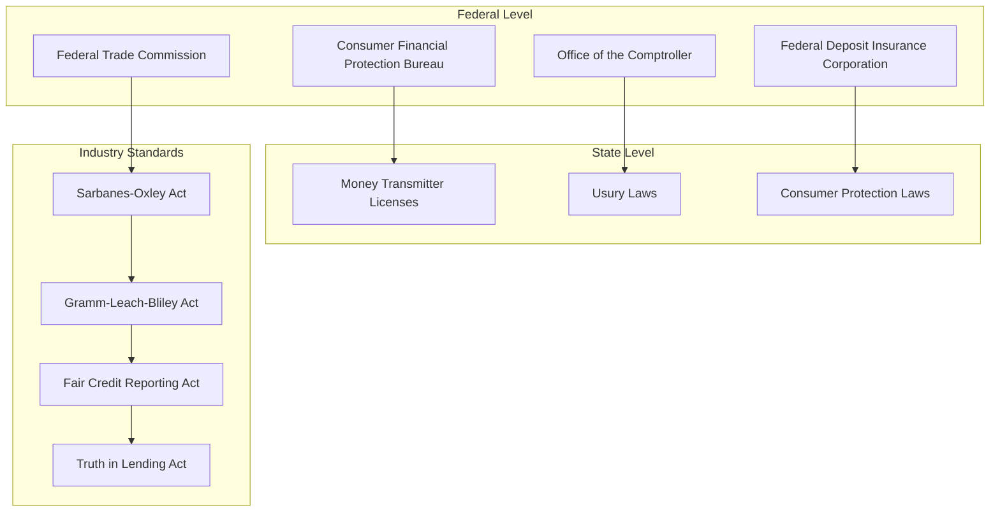
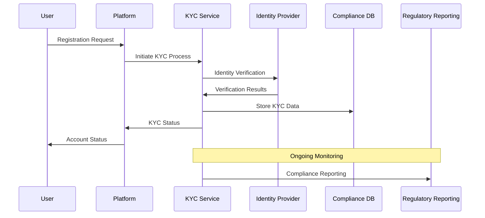
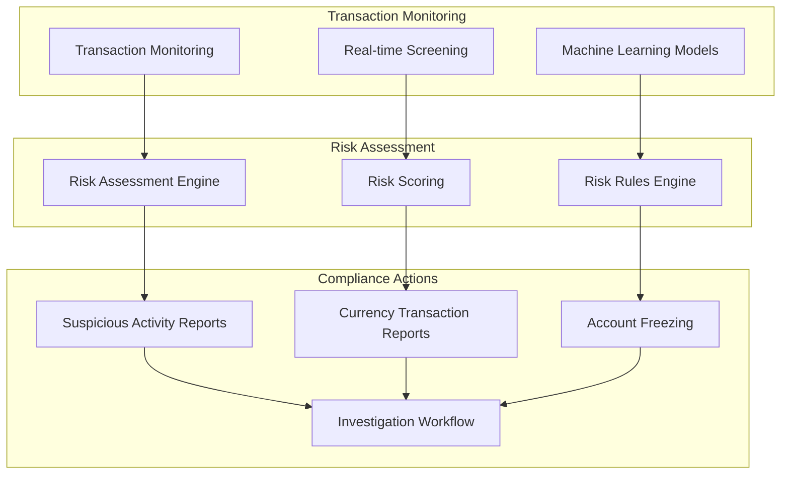
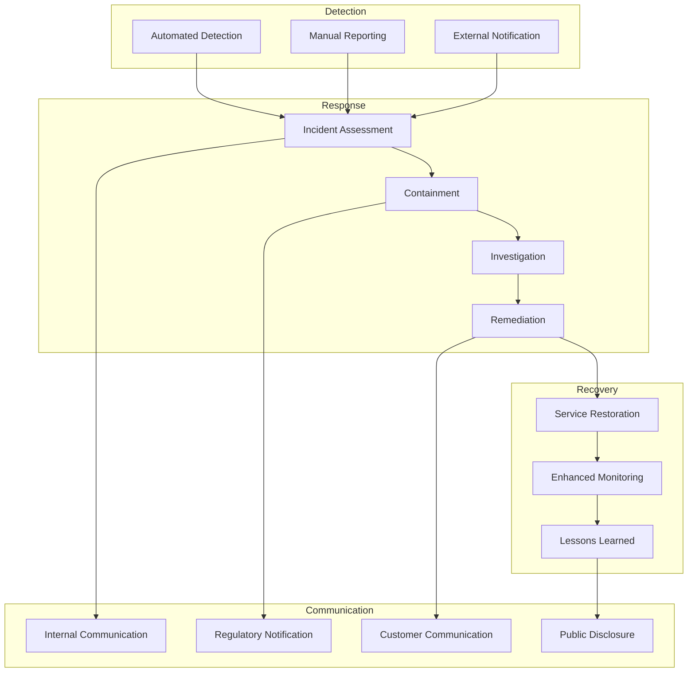

# Compliance & Security Framework
## Credit-as-a-Service Platform

### Executive Summary

This document outlines the comprehensive compliance and security framework for the Credit-as-a-Service Platform, ensuring adherence to financial regulations, data protection laws, and industry security standards across all operational jurisdictions.

## 1. Regulatory Compliance Framework

### 1.1 Financial Services Compliance

#### United States Compliance


#### European Union Compliance
- **PSD2 (Payment Services Directive 2)**: Strong customer authentication and open banking
- **GDPR (General Data Protection Regulation)**: Data protection and privacy rights
- **MiFID II**: Investment services and market transparency
- **AML5 (5th Anti-Money Laundering Directive)**: Enhanced due diligence requirements

#### Global Compliance Considerations
- **FATF Guidelines**: Financial Action Task Force recommendations
- **Basel III**: International banking regulations
- **Local Lending Laws**: Country-specific interest rate caps and consumer protections

### 1.2 Compliance Implementation Matrix

| Jurisdiction | License Required | Interest Rate Cap | KYC Level | AML Requirements | Data Residency |
|-------------|------------------|-------------------|-----------|------------------|----------------|
| US (Federal) | MSB Registration | State-dependent | Enhanced | BSA Compliance | No requirement |
| US (State) | Money Transmitter | 6-36% APR | Standard | State AML laws | State-dependent |
| EU | PSD2 License | Country-specific | Enhanced | AML5 Directive | EU residency |
| UK | FCA Authorization | 0.8% daily cap | Enhanced | MLR 2017 | UK residency |
| Canada | MSB License | 60% APR | Enhanced | FINTRAC | Canadian residency |
| Australia | AFSL | No cap | Enhanced | AML/CTF Act | Australian residency |

## 2. Know Your Customer (KYC) Framework

### 2.1 KYC Process Flow



### 2.2 Identity Verification Levels

#### Level 1: Basic Verification
- **Requirements**: Email, phone number, basic personal information
- **Verification**: Email/SMS OTP
- **Limits**: $1,000 transaction limit
- **Use Case**: Account creation and basic platform access

#### Level 2: Enhanced Verification
- **Requirements**: Government-issued ID, proof of address
- **Verification**: Document verification + liveness check
- **Limits**: $10,000 transaction limit
- **Use Case**: Standard credit applications

#### Level 3: Premium Verification
- **Requirements**: Enhanced due diligence, source of funds
- **Verification**: Manual review + additional documentation
- **Limits**: $100,000+ transaction limit
- **Use Case**: High-value transactions and institutional accounts

### 2.3 KYC Implementation

#### Identity Verification Providers
```typescript
interface KYCProvider {
  name: string;
  regions: string[];
  verificationLevels: KYCLevel[];
  documentTypes: DocumentType[];
  apiEndpoint: string;
}

const kycProviders: KYCProvider[] = [
  {
    name: "Sumsub",
    regions: ["Global"],
    verificationLevels: ["basic", "enhanced", "premium"],
    documentTypes: ["passport", "driverLicense", "nationalId"],
    apiEndpoint: "https://api.sumsub.com"
  },
  {
    name: "Jumio",
    regions: ["US", "EU", "APAC"],
    verificationLevels: ["enhanced", "premium"],
    documentTypes: ["passport", "driverLicense", "nationalId"],
    apiEndpoint: "https://api.jumio.com"
  }
];
```

#### KYC Data Schema
```sql
-- KYC Records Table
CREATE TABLE kyc_records (
    id UUID PRIMARY KEY DEFAULT gen_random_uuid(),
    user_id UUID NOT NULL REFERENCES users(id),
    verification_level kyc_level NOT NULL,
    status kyc_status NOT NULL DEFAULT 'pending',
    provider VARCHAR(50) NOT NULL,
    provider_reference_id VARCHAR(255),
    
    -- Personal Information
    first_name VARCHAR(100) NOT NULL,
    last_name VARCHAR(100) NOT NULL,
    date_of_birth DATE NOT NULL,
    nationality VARCHAR(3), -- ISO 3166-1 alpha-3
    
    -- Address Information
    address_line1 VARCHAR(255) NOT NULL,
    address_line2 VARCHAR(255),
    city VARCHAR(100) NOT NULL,
    state_province VARCHAR(100),
    postal_code VARCHAR(20) NOT NULL,
    country VARCHAR(3) NOT NULL, -- ISO 3166-1 alpha-3
    
    -- Verification Details
    document_type document_type NOT NULL,
    document_number VARCHAR(100) NOT NULL,
    document_expiry_date DATE,
    verification_date TIMESTAMP,
    
    -- Compliance Flags
    pep_status BOOLEAN DEFAULT FALSE, -- Politically Exposed Person
    sanctions_check BOOLEAN DEFAULT FALSE,
    adverse_media_check BOOLEAN DEFAULT FALSE,
    
    -- Audit Fields
    created_at TIMESTAMP DEFAULT CURRENT_TIMESTAMP,
    updated_at TIMESTAMP DEFAULT CURRENT_TIMESTAMP,
    created_by UUID REFERENCES users(id),
    
    -- Encryption and Compliance
    encrypted_data JSONB, -- Encrypted sensitive data
    retention_date DATE, -- Data retention compliance
    
    CONSTRAINT unique_user_verification UNIQUE(user_id, verification_level)
);

-- Indexes for performance and compliance
CREATE INDEX idx_kyc_records_user_id ON kyc_records(user_id);
CREATE INDEX idx_kyc_records_status ON kyc_records(status);
CREATE INDEX idx_kyc_records_retention_date ON kyc_records(retention_date);
```

## 3. Anti-Money Laundering (AML) Framework

### 3.1 AML Process Implementation



### 3.2 AML Risk Indicators

#### High-Risk Indicators
- **Geographic Risk**: Transactions from high-risk jurisdictions
- **Customer Risk**: PEPs, sanctions list matches, adverse media
- **Transaction Risk**: Unusual patterns, high-velocity transactions
- **Product Risk**: High-risk financial products or services

#### AML Rules Engine
```typescript
interface AMLRule {
  id: string;
  name: string;
  description: string;
  riskLevel: 'low' | 'medium' | 'high' | 'critical';
  conditions: AMLCondition[];
  actions: AMLAction[];
  enabled: boolean;
}

const amlRules: AMLRule[] = [
  {
    id: "AML001",
    name: "High Velocity Transactions",
    description: "Multiple transactions within short time period",
    riskLevel: "high",
    conditions: [
      {
        field: "transaction_count",
        operator: "greater_than",
        value: 10,
        timeframe: "1_hour"
      }
    ],
    actions: [
      { type: "flag_transaction" },
      { type: "require_manual_review" },
      { type: "notify_compliance_team" }
    ],
    enabled: true
  },
  {
    id: "AML002",
    name: "Sanctions List Match",
    description: "Customer matches sanctions list",
    riskLevel: "critical",
    conditions: [
      {
        field: "sanctions_match",
        operator: "equals",
        value: true
      }
    ],
    actions: [
      { type: "freeze_account" },
      { type: "file_sar" },
      { type: "escalate_to_legal" }
    ],
    enabled: true
  }
];
```

### 3.3 Sanctions Screening

#### Sanctions Lists Integration
- **OFAC (Office of Foreign Assets Control)**: US sanctions list
- **EU Consolidated List**: European Union sanctions
- **UN Security Council**: United Nations sanctions
- **HMT (Her Majesty's Treasury)**: UK sanctions list

#### Screening Implementation
```typescript
class SanctionsScreeningService {
  private sanctionsLists: SanctionsList[];
  
  async screenEntity(entity: KYCEntity): Promise<ScreeningResult> {
    const results: ScreeningMatch[] = [];
    
    for (const list of this.sanctionsLists) {
      const matches = await this.fuzzyMatch(entity, list);
      results.push(...matches);
    }
    
    return {
      entityId: entity.id,
      matches: results,
      riskScore: this.calculateRiskScore(results),
      screeningDate: new Date(),
      requiresReview: results.length > 0
    };
  }
  
  private async fuzzyMatch(entity: KYCEntity, list: SanctionsList): Promise<ScreeningMatch[]> {
    // Implement fuzzy matching algorithm
    // Consider name variations, aliases, phonetic matching
  }
}
```

## 4. Data Protection & Privacy

### 4.1 GDPR Compliance Implementation

#### Data Subject Rights
```typescript
interface DataSubjectRequest {
  id: string;
  userId: string;
  requestType: 'access' | 'rectification' | 'erasure' | 'portability' | 'restriction';
  status: 'pending' | 'processing' | 'completed' | 'rejected';
  requestDate: Date;
  completionDate?: Date;
  requestDetails: string;
  legalBasis?: string;
}

class GDPRComplianceService {
  async handleDataSubjectRequest(request: DataSubjectRequest): Promise<void> {
    switch (request.requestType) {
      case 'access':
        await this.provideDataAccess(request.userId);
        break;
      case 'erasure':
        await this.processDataErasure(request.userId);
        break;
      case 'portability':
        await this.exportUserData(request.userId);
        break;
      // ... other request types
    }
  }
  
  private async processDataErasure(userId: string): Promise<void> {
    // Implement right to be forgotten
    // Consider legal retention requirements
    // Anonymize rather than delete where required
  }
}
```

#### Data Retention Policy
```sql
-- Data Retention Configuration
CREATE TABLE data_retention_policies (
    id UUID PRIMARY KEY DEFAULT gen_random_uuid(),
    data_category VARCHAR(100) NOT NULL,
    retention_period_days INTEGER NOT NULL,
    legal_basis VARCHAR(255) NOT NULL,
    jurisdiction VARCHAR(3) NOT NULL,
    auto_deletion BOOLEAN DEFAULT TRUE,
    
    created_at TIMESTAMP DEFAULT CURRENT_TIMESTAMP,
    updated_at TIMESTAMP DEFAULT CURRENT_TIMESTAMP
);

-- Example retention policies
INSERT INTO data_retention_policies VALUES
('KYC_DATA', 2555, 'Legal obligation - AML regulations', 'USA', FALSE), -- 7 years
('TRANSACTION_DATA', 2555, 'Legal obligation - Financial records', 'USA', FALSE), -- 7 years
('MARKETING_DATA', 1095, 'Consent - Marketing communications', 'EU', TRUE), -- 3 years
('SESSION_DATA', 90, 'Legitimate interest - Security', 'GLOBAL', TRUE); -- 90 days
```

### 4.2 Data Encryption & Security

#### Encryption at Rest
```typescript
class DataEncryptionService {
  private readonly kmsClient: KMSClient;
  
  async encryptSensitiveData(data: any, dataType: string): Promise<EncryptedData> {
    const dataKey = await this.kmsClient.generateDataKey({
      KeyId: this.getKeyForDataType(dataType),
      KeySpec: 'AES_256'
    });
    
    const encryptedData = await this.encrypt(JSON.stringify(data), dataKey.Plaintext);
    
    return {
      encryptedData: encryptedData.toString('base64'),
      encryptedKey: dataKey.CiphertextBlob.toString('base64'),
      algorithm: 'AES-256-GCM',
      keyId: dataKey.KeyId
    };
  }
  
  async decryptSensitiveData(encryptedData: EncryptedData): Promise<any> {
    const dataKey = await this.kmsClient.decrypt({
      CiphertextBlob: Buffer.from(encryptedData.encryptedKey, 'base64')
    });
    
    const decryptedData = await this.decrypt(
      Buffer.from(encryptedData.encryptedData, 'base64'),
      dataKey.Plaintext
    );
    
    return JSON.parse(decryptedData.toString());
  }
}
```

#### Encryption in Transit
- **TLS 1.3**: All external communications
- **mTLS**: Internal service-to-service communication
- **Certificate Management**: Automated certificate rotation
- **HSTS**: HTTP Strict Transport Security headers

## 5. Smart Contract Security

### 5.1 Security Best Practices

#### Access Control Implementation
```solidity
// Enhanced access control with time-locked operations
contract SecureAccessControl is AccessControl, TimelockController {
    bytes32 public constant ADMIN_ROLE = keccak256("ADMIN_ROLE");
    bytes32 public constant OPERATOR_ROLE = keccak256("OPERATOR_ROLE");
    bytes32 public constant EMERGENCY_ROLE = keccak256("EMERGENCY_ROLE");
    
    uint256 public constant TIMELOCK_DELAY = 48 hours;
    
    modifier onlyEmergencyOrTimelock() {
        require(
            hasRole(EMERGENCY_ROLE, msg.sender) || 
            hasRole(TIMELOCK_ADMIN_ROLE, msg.sender),
            "Insufficient permissions"
        );
        _;
    }
    
    function emergencyPause() external onlyRole(EMERGENCY_ROLE) {
        _pause();
        emit EmergencyPauseActivated(msg.sender, block.timestamp);
    }
    
    function scheduleUpgrade(
        address newImplementation,
        bytes calldata data
    ) external onlyRole(ADMIN_ROLE) {
        bytes32 id = hashOperation(newImplementation, 0, data, 0, salt);
        schedule(newImplementation, 0, data, 0, salt, TIMELOCK_DELAY);
        emit UpgradeScheduled(id, newImplementation, block.timestamp + TIMELOCK_DELAY);
    }
}
```

#### Circuit Breaker Pattern
```solidity
contract CircuitBreaker {
    enum CircuitState { CLOSED, OPEN, HALF_OPEN }
    
    struct CircuitConfig {
        uint256 failureThreshold;
        uint256 timeout;
        uint256 successThreshold;
    }
    
    mapping(bytes32 => CircuitState) public circuitStates;
    mapping(bytes32 => uint256) public failureCounts;
    mapping(bytes32 => uint256) public lastFailureTime;
    mapping(bytes32 => CircuitConfig) public circuitConfigs;
    
    modifier circuitBreaker(bytes32 circuitId) {
        require(
            circuitStates[circuitId] != CircuitState.OPEN ||
            block.timestamp > lastFailureTime[circuitId] + circuitConfigs[circuitId].timeout,
            "Circuit breaker is open"
        );
        
        _;
        
        // Reset failure count on success
        if (circuitStates[circuitId] == CircuitState.HALF_OPEN) {
            circuitStates[circuitId] = CircuitState.CLOSED;
            failureCounts[circuitId] = 0;
        }
    }
    
    function _recordFailure(bytes32 circuitId) internal {
        failureCounts[circuitId]++;
        lastFailureTime[circuitId] = block.timestamp;
        
        if (failureCounts[circuitId] >= circuitConfigs[circuitId].failureThreshold) {
            circuitStates[circuitId] = CircuitState.OPEN;
            emit CircuitBreakerOpened(circuitId, block.timestamp);
        }
    }
}
```

### 5.2 Security Monitoring

#### Real-time Monitoring
```typescript
class SmartContractMonitoringService {
  private readonly web3Provider: ethers.Provider;
  private readonly alertingService: AlertingService;
  
  async monitorContract(contractAddress: string): Promise<void> {
    const contract = new ethers.Contract(contractAddress, ABI, this.web3Provider);
    
    // Monitor for unusual activity
    contract.on("*", (event) => {
      this.analyzeEvent(event);
    });
    
    // Monitor gas usage patterns
    setInterval(async () => {
      await this.checkGasUsagePatterns(contractAddress);
    }, 60000); // Every minute
    
    // Monitor contract balance changes
    setInterval(async () => {
      await this.checkBalanceAnomalies(contractAddress);
    }, 30000); // Every 30 seconds
  }
  
  private async analyzeEvent(event: any): Promise<void> {
    const riskScore = await this.calculateEventRiskScore(event);
    
    if (riskScore > CRITICAL_THRESHOLD) {
      await this.alertingService.sendCriticalAlert({
        type: 'SMART_CONTRACT_ANOMALY',
        contractAddress: event.address,
        event: event.event,
        riskScore: riskScore,
        timestamp: new Date()
      });
    }
  }
}
```

## 6. Compliance Monitoring & Reporting

### 6.1 Automated Compliance Reporting

```typescript
class ComplianceReportingService {
  async generateSARReport(suspiciousActivity: SuspiciousActivity): Promise<SARReport> {
    const report: SARReport = {
      id: generateReportId(),
      reportingInstitution: this.getInstitutionInfo(),
      suspiciousActivity: {
        subjectInformation: await this.getSubjectInfo(suspiciousActivity.userId),
        activityDescription: suspiciousActivity.description,
        transactionDetails: await this.getTransactionDetails(suspiciousActivity.transactionIds),
        suspicionReasons: suspiciousActivity.reasons
      },
      filingDate: new Date(),
      reportingOfficer: suspiciousActivity.reportingOfficer,
      status: 'PENDING_REVIEW'
    };
    
    await this.submitToRegulator(report);
    return report;
  }
  
  async generateCTRReport(transactions: Transaction[]): Promise<CTRReport> {
    // Generate Currency Transaction Report for transactions > $10,000
    const aggregatedTransactions = this.aggregateTransactions(transactions);
    
    return {
      id: generateReportId(),
      reportingInstitution: this.getInstitutionInfo(),
      transactions: aggregatedTransactions,
      reportingPeriod: this.getCurrentReportingPeriod(),
      filingDate: new Date()
    };
  }
}
```

### 6.2 Audit Trail Implementation

```sql
-- Comprehensive audit trail
CREATE TABLE audit_trail (
    id UUID PRIMARY KEY DEFAULT gen_random_uuid(),
    entity_type VARCHAR(50) NOT NULL, -- user, transaction, kyc_record, etc.
    entity_id UUID NOT NULL,
    action VARCHAR(50) NOT NULL, -- create, update, delete, view, etc.
    actor_id UUID, -- who performed the action
    actor_type VARCHAR(50), -- user, system, admin, etc.
    
    -- Change details
    old_values JSONB,
    new_values JSONB,
    changed_fields TEXT[],
    
    -- Context
    ip_address INET,
    user_agent TEXT,
    session_id VARCHAR(255),
    request_id VARCHAR(255),
    
    -- Compliance
    compliance_reason VARCHAR(255),
    legal_basis VARCHAR(255),
    retention_date DATE,
    
    -- Audit metadata
    created_at TIMESTAMP DEFAULT CURRENT_TIMESTAMP,
    
    -- Immutability protection
    hash VARCHAR(64) NOT NULL, -- SHA-256 hash of record
    previous_hash VARCHAR(64), -- Chain of custody
    
    CONSTRAINT audit_trail_hash_unique UNIQUE(hash)
);

-- Indexes for audit queries
CREATE INDEX idx_audit_trail_entity ON audit_trail(entity_type, entity_id);
CREATE INDEX idx_audit_trail_actor ON audit_trail(actor_id, actor_type);
CREATE INDEX idx_audit_trail_timestamp ON audit_trail(created_at);
CREATE INDEX idx_audit_trail_action ON audit_trail(action);
```

## 7. Incident Response & Business Continuity

### 7.1 Security Incident Response Plan



### 7.2 Business Continuity Planning

#### Disaster Recovery Procedures
- **RTO (Recovery Time Objective)**: 4 hours for critical services
- **RPO (Recovery Point Objective)**: 15 minutes for transaction data
- **Backup Strategy**: 3-2-1 backup rule (3 copies, 2 different media, 1 offsite)
- **Failover Procedures**: Automated failover for critical services

#### Crisis Communication Plan
- **Internal Escalation**: Clear escalation matrix for different incident types
- **Regulatory Notification**: Automated templates for regulatory reporting
- **Customer Communication**: Pre-approved messaging for different scenarios
- **Media Relations**: Designated spokesperson and approved statements

This comprehensive compliance and security framework ensures the Credit-as-a-Service Platform meets the highest standards for financial services while maintaining operational efficiency and user experience.
