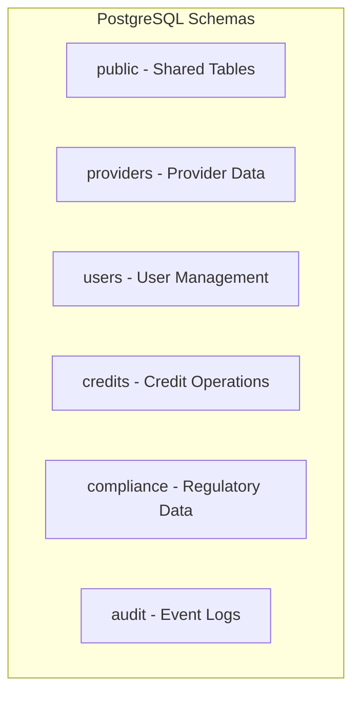
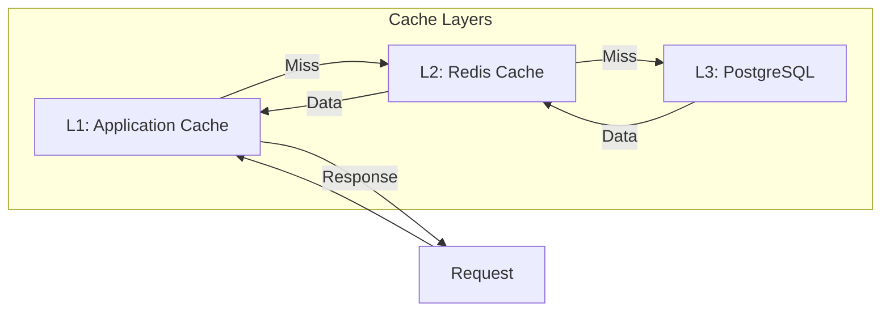
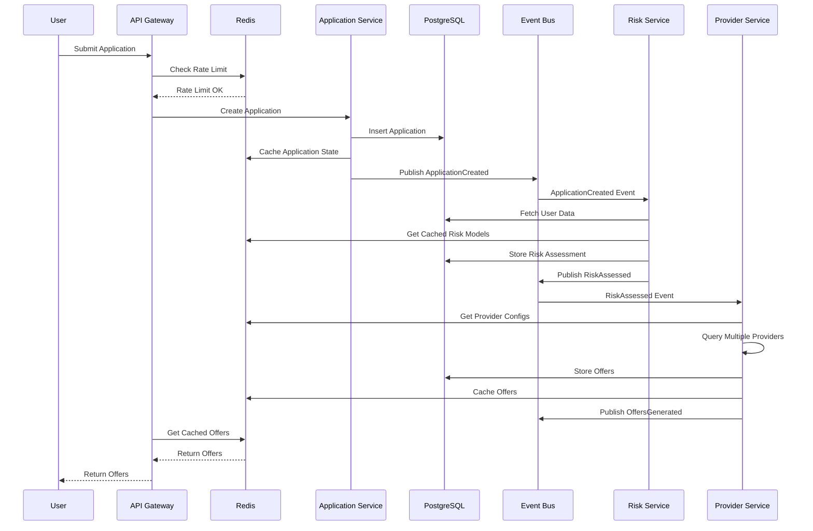
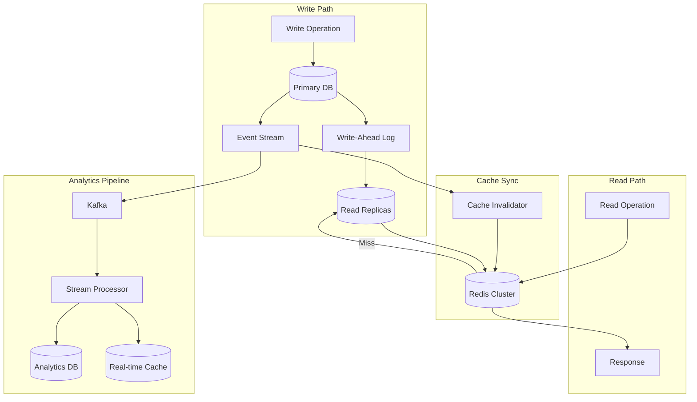

# Data Architecture

## Overview

The Credit-as-a-Service Platform leverages a multi-layered data architecture designed for high performance, scalability, and data integrity. This document outlines the database schemas, caching strategies, data flow patterns, and synchronization mechanisms across the platform.

## Architecture Principles

- **Data Locality**: Store data close to where it's processed
- **Event Sourcing**: Maintain audit trails through event streams
- **CQRS Pattern**: Separate read and write operations for optimization
- **Cache-First**: Reduce database load through intelligent caching
- **Data Partitioning**: Scale horizontally through strategic partitioning

## PostgreSQL Database Architecture

### Database Structure

```sql
-- Database: credit_platform
CREATE DATABASE credit_platform
    WITH 
    OWNER = credit_admin
    ENCODING = 'UTF8'
    LC_COLLATE = 'en_US.utf8'
    LC_CTYPE = 'en_US.utf8'
    TABLESPACE = pg_default
    CONNECTION LIMIT = -1;
```

### Schema Organization



### Core Schemas

#### 1. Users Schema

```sql
-- Users table
CREATE TABLE users.users (
    id UUID PRIMARY KEY DEFAULT gen_random_uuid(),
    email VARCHAR(255) UNIQUE NOT NULL,
    phone_number VARCHAR(20),
    status VARCHAR(50) DEFAULT 'ACTIVE',
    kyc_status VARCHAR(50) DEFAULT 'PENDING',
    risk_score DECIMAL(5,2),
    created_at TIMESTAMP WITH TIME ZONE DEFAULT CURRENT_TIMESTAMP,
    updated_at TIMESTAMP WITH TIME ZONE DEFAULT CURRENT_TIMESTAMP,
    metadata JSONB DEFAULT '{}'::jsonb
);

-- User profiles
CREATE TABLE users.profiles (
    id UUID PRIMARY KEY DEFAULT gen_random_uuid(),
    user_id UUID REFERENCES users.users(id) ON DELETE CASCADE,
    first_name VARCHAR(100),
    last_name VARCHAR(100),
    date_of_birth DATE,
    ssn_hash VARCHAR(256),
    address_line1 VARCHAR(255),
    address_line2 VARCHAR(255),
    city VARCHAR(100),
    state VARCHAR(50),
    postal_code VARCHAR(20),
    country VARCHAR(2) DEFAULT 'US',
    created_at TIMESTAMP WITH TIME ZONE DEFAULT CURRENT_TIMESTAMP,
    updated_at TIMESTAMP WITH TIME ZONE DEFAULT CURRENT_TIMESTAMP
);

-- User documents
CREATE TABLE users.documents (
    id UUID PRIMARY KEY DEFAULT gen_random_uuid(),
    user_id UUID REFERENCES users.users(id) ON DELETE CASCADE,
    document_type VARCHAR(50) NOT NULL,
    document_hash VARCHAR(256) NOT NULL,
    storage_path VARCHAR(500),
    verified BOOLEAN DEFAULT FALSE,
    verified_at TIMESTAMP WITH TIME ZONE,
    expires_at TIMESTAMP WITH TIME ZONE,
    created_at TIMESTAMP WITH TIME ZONE DEFAULT CURRENT_TIMESTAMP
);

-- Indexes
CREATE INDEX idx_users_email ON users.users(email);
CREATE INDEX idx_users_status ON users.users(status);
CREATE INDEX idx_users_kyc_status ON users.users(kyc_status);
CREATE INDEX idx_profiles_user_id ON users.profiles(user_id);
CREATE INDEX idx_documents_user_id ON users.documents(user_id);
CREATE INDEX idx_documents_type ON users.documents(document_type);
```

#### 2. Providers Schema

```sql
-- Credit providers
CREATE TABLE providers.providers (
    id UUID PRIMARY KEY DEFAULT gen_random_uuid(),
    name VARCHAR(255) NOT NULL,
    type VARCHAR(50) NOT NULL, -- 'TRADITIONAL', 'DEFI', 'HYBRID'
    status VARCHAR(50) DEFAULT 'ACTIVE',
    api_endpoint VARCHAR(500),
    api_version VARCHAR(20),
    rate_limit_per_minute INTEGER DEFAULT 60,
    supported_products JSONB DEFAULT '[]'::jsonb,
    configuration JSONB DEFAULT '{}'::jsonb,
    created_at TIMESTAMP WITH TIME ZONE DEFAULT CURRENT_TIMESTAMP,
    updated_at TIMESTAMP WITH TIME ZONE DEFAULT CURRENT_TIMESTAMP
);

-- Provider credentials (encrypted)
CREATE TABLE providers.credentials (
    id UUID PRIMARY KEY DEFAULT gen_random_uuid(),
    provider_id UUID REFERENCES providers.providers(id) ON DELETE CASCADE,
    credential_type VARCHAR(50) NOT NULL,
    encrypted_value TEXT NOT NULL,
    expires_at TIMESTAMP WITH TIME ZONE,
    created_at TIMESTAMP WITH TIME ZONE DEFAULT CURRENT_TIMESTAMP,
    rotated_at TIMESTAMP WITH TIME ZONE
);

-- Provider webhooks
CREATE TABLE providers.webhooks (
    id UUID PRIMARY KEY DEFAULT gen_random_uuid(),
    provider_id UUID REFERENCES providers.providers(id) ON DELETE CASCADE,
    event_type VARCHAR(100) NOT NULL,
    url VARCHAR(500) NOT NULL,
    secret_hash VARCHAR(256),
    active BOOLEAN DEFAULT TRUE,
    retry_count INTEGER DEFAULT 0,
    last_triggered_at TIMESTAMP WITH TIME ZONE,
    created_at TIMESTAMP WITH TIME ZONE DEFAULT CURRENT_TIMESTAMP
);

-- Rate limiting
CREATE TABLE providers.rate_limits (
    id UUID PRIMARY KEY DEFAULT gen_random_uuid(),
    provider_id UUID REFERENCES providers.providers(id) ON DELETE CASCADE,
    endpoint VARCHAR(255) NOT NULL,
    limit_per_minute INTEGER NOT NULL,
    limit_per_hour INTEGER,
    limit_per_day INTEGER,
    current_minute_count INTEGER DEFAULT 0,
    current_hour_count INTEGER DEFAULT 0,
    current_day_count INTEGER DEFAULT 0,
    reset_minute_at TIMESTAMP WITH TIME ZONE,
    reset_hour_at TIMESTAMP WITH TIME ZONE,
    reset_day_at TIMESTAMP WITH TIME ZONE,
    UNIQUE(provider_id, endpoint)
);

-- Indexes
CREATE INDEX idx_providers_type ON providers.providers(type);
CREATE INDEX idx_providers_status ON providers.providers(status);
CREATE INDEX idx_webhooks_provider_event ON providers.webhooks(provider_id, event_type);
CREATE INDEX idx_rate_limits_provider_endpoint ON providers.rate_limits(provider_id, endpoint);
```

#### 3. Credits Schema

```sql
-- Credit applications
CREATE TABLE credits.applications (
    id UUID PRIMARY KEY DEFAULT gen_random_uuid(),
    user_id UUID REFERENCES users.users(id) ON DELETE CASCADE,
    application_number VARCHAR(50) UNIQUE NOT NULL,
    requested_amount DECIMAL(15,2) NOT NULL,
    currency VARCHAR(3) DEFAULT 'USD',
    purpose VARCHAR(255),
    term_months INTEGER,
    status VARCHAR(50) DEFAULT 'PENDING',
    risk_assessment_id UUID,
    compliance_check_id UUID,
    decision VARCHAR(50),
    decision_reason TEXT,
    created_at TIMESTAMP WITH TIME ZONE DEFAULT CURRENT_TIMESTAMP,
    updated_at TIMESTAMP WITH TIME ZONE DEFAULT CURRENT_TIMESTAMP,
    submitted_at TIMESTAMP WITH TIME ZONE,
    decided_at TIMESTAMP WITH TIME ZONE,
    metadata JSONB DEFAULT '{}'::jsonb
);

-- Credit offers
CREATE TABLE credits.offers (
    id UUID PRIMARY KEY DEFAULT gen_random_uuid(),
    application_id UUID REFERENCES credits.applications(id) ON DELETE CASCADE,
    provider_id UUID REFERENCES providers.providers(id),
    offer_reference VARCHAR(255) NOT NULL,
    amount DECIMAL(15,2) NOT NULL,
    currency VARCHAR(3) DEFAULT 'USD',
    interest_rate DECIMAL(5,2) NOT NULL,
    apr DECIMAL(5,2) NOT NULL,
    term_months INTEGER NOT NULL,
    monthly_payment DECIMAL(15,2),
    total_repayment DECIMAL(15,2),
    fees JSONB DEFAULT '[]'::jsonb,
    collateral_required BOOLEAN DEFAULT FALSE,
    collateral_details JSONB,
    status VARCHAR(50) DEFAULT 'PENDING',
    valid_until TIMESTAMP WITH TIME ZONE,
    accepted_at TIMESTAMP WITH TIME ZONE,
    declined_at TIMESTAMP WITH TIME ZONE,
    created_at TIMESTAMP WITH TIME ZONE DEFAULT CURRENT_TIMESTAMP
);

-- Active credits
CREATE TABLE credits.active_credits (
    id UUID PRIMARY KEY DEFAULT gen_random_uuid(),
    user_id UUID REFERENCES users.users(id) ON DELETE CASCADE,
    offer_id UUID REFERENCES credits.offers(id),
    credit_number VARCHAR(50) UNIQUE NOT NULL,
    principal_amount DECIMAL(15,2) NOT NULL,
    outstanding_balance DECIMAL(15,2) NOT NULL,
    interest_rate DECIMAL(5,2) NOT NULL,
    term_months INTEGER NOT NULL,
    monthly_payment DECIMAL(15,2) NOT NULL,
    next_payment_date DATE,
    status VARCHAR(50) DEFAULT 'ACTIVE',
    smart_contract_address VARCHAR(255),
    disbursed_at TIMESTAMP WITH TIME ZONE,
    maturity_date DATE,
    closed_at TIMESTAMP WITH TIME ZONE,
    created_at TIMESTAMP WITH TIME ZONE DEFAULT CURRENT_TIMESTAMP,
    updated_at TIMESTAMP WITH TIME ZONE DEFAULT CURRENT_TIMESTAMP
);

-- Payment history
CREATE TABLE credits.payments (
    id UUID PRIMARY KEY DEFAULT gen_random_uuid(),
    credit_id UUID REFERENCES credits.active_credits(id) ON DELETE CASCADE,
    payment_number INTEGER NOT NULL,
    due_date DATE NOT NULL,
    payment_date TIMESTAMP WITH TIME ZONE,
    due_amount DECIMAL(15,2) NOT NULL,
    principal_amount DECIMAL(15,2) NOT NULL,
    interest_amount DECIMAL(15,2) NOT NULL,
    fees_amount DECIMAL(15,2) DEFAULT 0,
    total_paid DECIMAL(15,2),
    status VARCHAR(50) DEFAULT 'PENDING',
    transaction_hash VARCHAR(255),
    payment_method VARCHAR(50),
    created_at TIMESTAMP WITH TIME ZONE DEFAULT CURRENT_TIMESTAMP
);

-- Indexes
CREATE INDEX idx_applications_user_id ON credits.applications(user_id);
CREATE INDEX idx_applications_status ON credits.applications(status);
CREATE INDEX idx_applications_number ON credits.applications(application_number);
CREATE INDEX idx_offers_application_id ON credits.offers(application_id);
CREATE INDEX idx_offers_provider_id ON credits.offers(provider_id);
CREATE INDEX idx_offers_status ON credits.offers(status);
CREATE INDEX idx_active_credits_user_id ON credits.active_credits(user_id);
CREATE INDEX idx_active_credits_status ON credits.active_credits(status);
CREATE INDEX idx_payments_credit_id ON credits.payments(credit_id);
CREATE INDEX idx_payments_status ON credits.payments(status);
CREATE INDEX idx_payments_due_date ON credits.payments(due_date);
```

#### 4. Compliance Schema

```sql
-- KYC records
CREATE TABLE compliance.kyc_records (
    id UUID PRIMARY KEY DEFAULT gen_random_uuid(),
    user_id UUID REFERENCES users.users(id) ON DELETE CASCADE,
    verification_type VARCHAR(50) NOT NULL,
    verification_status VARCHAR(50) DEFAULT 'PENDING',
    provider VARCHAR(100),
    provider_reference VARCHAR(255),
    risk_score DECIMAL(5,2),
    risk_factors JSONB DEFAULT '[]'::jsonb,
    documents_verified JSONB DEFAULT '[]'::jsonb,
    verified_at TIMESTAMP WITH TIME ZONE,
    expires_at TIMESTAMP WITH TIME ZONE,
    created_at TIMESTAMP WITH TIME ZONE DEFAULT CURRENT_TIMESTAMP,
    updated_at TIMESTAMP WITH TIME ZONE DEFAULT CURRENT_TIMESTAMP
);

-- AML checks
CREATE TABLE compliance.aml_checks (
    id UUID PRIMARY KEY DEFAULT gen_random_uuid(),
    user_id UUID REFERENCES users.users(id) ON DELETE CASCADE,
    check_type VARCHAR(50) NOT NULL,
    status VARCHAR(50) DEFAULT 'PENDING',
    provider VARCHAR(100),
    provider_reference VARCHAR(255),
    risk_level VARCHAR(20),
    matches JSONB DEFAULT '[]'::jsonb,
    checked_at TIMESTAMP WITH TIME ZONE,
    next_check_date DATE,
    created_at TIMESTAMP WITH TIME ZONE DEFAULT CURRENT_TIMESTAMP
);

-- Regulatory reporting
CREATE TABLE compliance.regulatory_reports (
    id UUID PRIMARY KEY DEFAULT gen_random_uuid(),
    report_type VARCHAR(100) NOT NULL,
    report_period_start DATE NOT NULL,
    report_period_end DATE NOT NULL,
    jurisdiction VARCHAR(50) NOT NULL,
    status VARCHAR(50) DEFAULT 'PENDING',
    data JSONB NOT NULL,
    submitted_at TIMESTAMP WITH TIME ZONE,
    submission_reference VARCHAR(255),
    created_at TIMESTAMP WITH TIME ZONE DEFAULT CURRENT_TIMESTAMP
);

-- Indexes
CREATE INDEX idx_kyc_user_id ON compliance.kyc_records(user_id);
CREATE INDEX idx_kyc_status ON compliance.kyc_records(verification_status);
CREATE INDEX idx_aml_user_id ON compliance.aml_checks(user_id);
CREATE INDEX idx_aml_status ON compliance.aml_checks(status);
CREATE INDEX idx_regulatory_type_period ON compliance.regulatory_reports(report_type, report_period_start);
```

#### 5. Audit Schema

```sql
-- Event log
CREATE TABLE audit.events (
    id UUID PRIMARY KEY DEFAULT gen_random_uuid(),
    event_type VARCHAR(100) NOT NULL,
    aggregate_type VARCHAR(100) NOT NULL,
    aggregate_id UUID NOT NULL,
    user_id UUID,
    service_name VARCHAR(100) NOT NULL,
    event_data JSONB NOT NULL,
    metadata JSONB DEFAULT '{}'::jsonb,
    correlation_id UUID,
    causation_id UUID,
    created_at TIMESTAMP WITH TIME ZONE DEFAULT CURRENT_TIMESTAMP,
    INDEX idx_events_aggregate (aggregate_type, aggregate_id),
    INDEX idx_events_user_id (user_id),
    INDEX idx_events_created_at (created_at),
    INDEX idx_events_correlation_id (correlation_id)
) PARTITION BY RANGE (created_at);

-- Create monthly partitions
CREATE TABLE audit.events_2024_01 PARTITION OF audit.events
    FOR VALUES FROM ('2024-01-01') TO ('2024-02-01');

-- API access logs
CREATE TABLE audit.api_access_logs (
    id UUID PRIMARY KEY DEFAULT gen_random_uuid(),
    request_id UUID NOT NULL,
    user_id UUID,
    ip_address INET,
    user_agent TEXT,
    method VARCHAR(10) NOT NULL,
    path VARCHAR(500) NOT NULL,
    query_params JSONB,
    request_body_size INTEGER,
    response_status INTEGER,
    response_time_ms INTEGER,
    error_message TEXT,
    created_at TIMESTAMP WITH TIME ZONE DEFAULT CURRENT_TIMESTAMP,
    INDEX idx_api_logs_user_id (user_id),
    INDEX idx_api_logs_created_at (created_at),
    INDEX idx_api_logs_path (path)
) PARTITION BY RANGE (created_at);
```

## Redis Caching Architecture

### Cache Strategy Overview



### Redis Data Structures

#### 1. User Session Cache

```typescript
// Key pattern: session:{sessionId}
interface SessionCache {
  userId: string;
  email: string;
  roles: string[];
  permissions: string[];
  lastAccessed: number;
  expiresAt: number;
}

// Key pattern: user:{userId}:profile
interface UserProfileCache {
  id: string;
  email: string;
  firstName: string;
  lastName: string;
  kycStatus: string;
  riskScore: number;
  ttl: 3600; // 1 hour
}
```

#### 2. Provider Cache

```typescript
// Key pattern: provider:{providerId}:config
interface ProviderConfigCache {
  id: string;
  name: string;
  type: string;
  apiEndpoint: string;
  rateLimit: number;
  supportedProducts: string[];
  ttl: 86400; // 24 hours
}

// Key pattern: provider:{providerId}:rates
interface ProviderRatesCache {
  providerId: string;
  productType: string;
  minRate: number;
  maxRate: number;
  baseRate: number;
  lastUpdated: number;
  ttl: 300; // 5 minutes
}
```

#### 3. Application State Cache

```typescript
// Key pattern: application:{applicationId}:state
interface ApplicationStateCache {
  applicationId: string;
  userId: string;
  status: string;
  currentStep: string;
  completedSteps: string[];
  expiresAt: number;
  ttl: 7200; // 2 hours
}

// Key pattern: application:{applicationId}:offers
// Using Redis Sorted Set for ranking offers
interface OfferCache {
  offerId: string;
  providerId: string;
  apr: number;
  amount: number;
  score: number; // Ranking score
}
```

#### 4. Rate Limiting

```typescript
// Key pattern: ratelimit:{userId}:{resource}
// Using Redis Strings with TTL
interface RateLimitCache {
  count: number;
  windowStart: number;
  ttl: number; // Window duration
}

// Key pattern: ratelimit:provider:{providerId}:{endpoint}
// Using Redis Sorted Set for sliding window
interface ProviderRateLimitCache {
  timestamp: number;
  requestId: string;
}
```

#### 5. Real-time Analytics

```typescript
// Key pattern: analytics:credits:active:{date}
// Using Redis HyperLogLog for unique counts
interface ActiveCreditsAnalytics {
  uniqueUsers: HyperLogLog;
  totalAmount: number;
  averageAmount: number;
}

// Key pattern: analytics:applications:{date}:{hour}
// Using Redis Hash
interface ApplicationMetrics {
  submitted: number;
  approved: number;
  rejected: number;
  pending: number;
  averageProcessingTime: number;
}
```

### Cache Invalidation Strategies

#### 1. TTL-Based Invalidation

```yaml
cache_ttl_config:
  user_profile: 3600 # 1 hour
  provider_config: 86400 # 24 hours
  provider_rates: 300 # 5 minutes
  application_state: 7200 # 2 hours
  session_data: 1800 # 30 minutes
  analytics_realtime: 60 # 1 minute
  analytics_aggregated: 3600 # 1 hour
```

#### 2. Event-Based Invalidation

```typescript
// Event handlers for cache invalidation
const cacheInvalidationHandlers = {
  'user.profile.updated': async (event) => {
    await redis.del(`user:${event.userId}:profile`);
    await redis.del(`user:${event.userId}:permissions`);
  },
  
  'provider.config.updated': async (event) => {
    await redis.del(`provider:${event.providerId}:config`);
    await redis.del(`provider:${event.providerId}:rates`);
  },
  
  'application.status.changed': async (event) => {
    await redis.del(`application:${event.applicationId}:state`);
    if (event.newStatus === 'COMPLETED') {
      await redis.del(`application:${event.applicationId}:offers`);
    }
  },
  
  'credit.payment.processed': async (event) => {
    await redis.del(`credit:${event.creditId}:balance`);
    await redis.del(`user:${event.userId}:credits`);
  }
};
```

#### 3. Cache Warming

```typescript
// Scheduled cache warming jobs
const cacheWarmingJobs = {
  // Warm provider configurations daily
  warmProviderConfigs: {
    schedule: '0 0 * * *', // Daily at midnight
    handler: async () => {
      const providers = await db.query('SELECT * FROM providers.providers WHERE status = $1', ['ACTIVE']);
      for (const provider of providers) {
        await redis.setex(
          `provider:${provider.id}:config`,
          86400,
          JSON.stringify(provider)
        );
      }
    }
  },
  
  // Warm active credit data every hour
  warmActiveCredits: {
    schedule: '0 * * * *', // Every hour
    handler: async () => {
      const activeCredits = await db.query(`
        SELECT c.*, u.email, u.risk_score 
        FROM credits.active_credits c
        JOIN users.users u ON c.user_id = u.id
        WHERE c.status = 'ACTIVE'
      `);
      
      for (const credit of activeCredits) {
        await redis.setex(
          `credit:${credit.id}:details`,
          3600,
          JSON.stringify(credit)
        );
      }
    }
  }
};
```

## Data Flow Patterns

### 1. Credit Application Flow



### 2. Real-time Data Synchronization



### 3. Event Sourcing Pattern

```typescript
// Event sourcing implementation
interface DomainEvent {
  id: string;
  eventType: string;
  aggregateType: string;
  aggregateId: string;
  eventData: any;
  metadata: {
    userId?: string;
    correlationId: string;
    causationId?: string;
    timestamp: Date;
  };
}

// Event store implementation
class EventStore {
  async append(event: DomainEvent): Promise<void> {
    // Store in PostgreSQL
    await db.query(`
      INSERT INTO audit.events 
      (id, event_type, aggregate_type, aggregate_id, event_data, metadata, correlation_id, causation_id, user_id)
      VALUES ($1, $2, $3, $4, $5, $6, $7, $8, $9)
    `, [
      event.id,
      event.eventType,
      event.aggregateType,
      event.aggregateId,
      event.eventData,
      event.metadata,
      event.metadata.correlationId,
      event.metadata.causationId,
      event.metadata.userId
    ]);
    
    // Publish to event bus
    await eventBus.publish(event.eventType, event);
  }
  
  async getEvents(aggregateId: string, fromVersion?: number): Promise<DomainEvent[]> {
    const result = await db.query(`
      SELECT * FROM audit.events 
      WHERE aggregate_id = $1 
      ${fromVersion ? 'AND version > $2' : ''}
      ORDER BY created_at ASC
    `, fromVersion ? [aggregateId, fromVersion] : [aggregateId]);
    
    return result.rows;
  }
}

// Aggregate reconstruction
class CreditApplicationAggregate {
  private events: DomainEvent[] = [];
  private version = 0;
  public state: any = {};
  
  async load(applicationId: string): Promise<void> {
    this.events = await eventStore.getEvents(applicationId);
    this.rebuild();
  }
  
  private rebuild(): void {
    this.state = this.events.reduce((state, event) => {
      return this.apply(state, event);
    }, {});
    this.version = this.events.length;
  }
  
  private apply(state: any, event: DomainEvent): any {
    switch (event.eventType) {
      case 'ApplicationCreated':
        return {
          ...state,
          id: event.aggregateId,
          ...event.eventData,
          status: 'CREATED'
        };
      
      case 'ApplicationSubmitted':
        return {
          ...state,
          status: 'SUBMITTED',
          submittedAt: event.metadata.timestamp
        };
      
      case 'RiskAssessmentCompleted':
        return {
          ...state,
          riskScore: event.eventData.riskScore,
          riskFactors: event.eventData.riskFactors
        };
      
      case 'OfferGenerated':
        return {
          ...state,
          offers: [...(state.offers || []), event.eventData.offer]
        };
      
      case 'OfferAccepted':
        return {
          ...state,
          status: 'ACCEPTED',
          acceptedOfferId: event.eventData.offerId,
          acceptedAt: event.metadata.timestamp
        };
      
      default:
        return state;
    }
  }
}
```

## Data Partitioning Strategy

### 1. Time-Based Partitioning

```sql
-- Partition audit events by month
CREATE TABLE audit.events_2024_02 PARTITION OF audit.events
    FOR VALUES FROM ('2024-02-01') TO ('2024-03-01');

-- Automated partition creation
CREATE OR REPLACE FUNCTION create_monthly_partition()
RETURNS void AS $$
DECLARE
    start_date date;
    end_date date;
    partition_name text;
BEGIN
    start_date := date_trunc('month', CURRENT_DATE + interval '1 month');
    end_date := start_date + interval '1 month';
    partition_name := 'audit.events_' || to_char(start_date, 'YYYY_MM');
    
    EXECUTE format('CREATE TABLE IF NOT EXISTS %I PARTITION OF audit.events FOR VALUES FROM (%L) TO (%L)',
        partition_name, start_date, end_date);
END;
$$ LANGUAGE plpgsql;

-- Schedule monthly execution
SELECT cron.schedule('create-monthly-partitions', '0 0 1 * *', 'SELECT create_monthly_partition()');
```

### 2. Sharding Strategy

```typescript
// User-based sharding for horizontal scaling
class ShardManager {
  private shards: Map<number, DatabaseConnection> = new Map();
  private shardCount = 4;
  
  getShardForUser(userId: string): DatabaseConnection {
    const shardKey = this.calculateShardKey(userId);
    return this.shards.get(shardKey)!;
  }
  
  private calculateShardKey(userId: string): number {
    // Use consistent hashing for even distribution
    const hash = crypto.createHash('md5').update(userId).digest('hex');
    const hashInt = parseInt(hash.substring(0, 8), 16);
    return hashInt % this.shardCount;
  }
  
  async executeQuery(userId: string, query: string, params: any[]): Promise<any> {
    const shard = this.getShardForUser(userId);
    return shard.query(query, params);
  }
}
```

## Performance Optimization

### 1. Query Optimization

```sql
-- Materialized view for user credit summary
CREATE MATERIALIZED VIEW credits.user_credit_summary AS
SELECT 
    u.id as user_id,
    u.email,
    COUNT(DISTINCT ac.id) as active_credits_count,
    SUM(ac.outstanding_balance) as total_outstanding,
    MIN(p.due_date) as next_payment_date,
    MAX(ac.created_at) as last_credit_date
FROM users.users u
LEFT JOIN credits.active_credits ac ON u.id = ac.user_id AND ac.status = 'ACTIVE'
LEFT JOIN credits.payments p ON ac.id = p.credit_id AND p.status = 'PENDING'
GROUP BY u.id, u.email;

-- Refresh strategy
CREATE INDEX idx_user_credit_summary_user_id ON credits.user_credit_summary(user_id);
REFRESH MATERIALIZED VIEW CONCURRENTLY credits.user_credit_summary;

-- Schedule refresh
SELECT cron.schedule('refresh-credit-summary', '*/10 * * * *', 'REFRESH MATERIALIZED VIEW CONCURRENTLY credits.user_credit_summary');
```

### 2. Connection Pooling

```yaml
# Database connection pool configuration
database:
    host: postgres-primary.db.local
    port: 5432
    database: credit_platform
    pool:
      min: 10
      max: 50
      acquireTimeout: 30000
      idleTimeout: 10000
      reapInterval: 1000
      
  read_replicas:
    - host: postgres-replica-1.db.local
      port: 5432
      weight: 1
    - host: postgres-replica-2.db.local
      port: 5432
      weight: 1
    pool:
      min: 20
      max: 100
      acquireTimeout: 30000

redis:
  cluster:
    nodes:
      - host: redis-1.cache.local
        port: 6379
      - host: redis-2.cache.local
        port: 6379
      - host: redis-3.cache.local
        port: 6379
    options:
      enableReadyCheck: true
      maxRetriesPerRequest: 3
      retryDelayOnFailover: 100
      retryDelayOnClusterDown: 300
```

### 3. Index Strategy

```sql
-- Composite indexes for common queries
CREATE INDEX idx_applications_user_status_created 
    ON credits.applications(user_id, status, created_at DESC);

CREATE INDEX idx_offers_app_status_valid 
    ON credits.offers(application_id, status, valid_until)
    WHERE status = 'PENDING';

CREATE INDEX idx_active_credits_user_status_next_payment 
    ON credits.active_credits(user_id, status, next_payment_date)
    WHERE status = 'ACTIVE';

-- Partial indexes for specific conditions
CREATE INDEX idx_users_kyc_pending 
    ON users.users(created_at)
    WHERE kyc_status = 'PENDING';

CREATE INDEX idx_payments_overdue 
    ON credits.payments(credit_id, due_date)
    WHERE status = 'PENDING' AND due_date < CURRENT_DATE;

-- GIN indexes for JSONB columns
CREATE INDEX idx_users_metadata_gin ON users.users USING GIN (metadata);
CREATE INDEX idx_applications_metadata_gin ON credits.applications USING GIN (metadata);
CREATE INDEX idx_offers_fees_gin ON credits.offers USING GIN (fees);
```

## Data Security

### 1. Encryption at Rest

```yaml
# PostgreSQL encryption configuration
postgresql:
  encryption:
    method: "TDE" # Transparent Data Encryption
    key_management: "AWS_KMS"
    master_key_rotation: "90_days"
    
  column_encryption:
    - table: users.users
      columns: ["email", "phone_number"]
      method: "pgcrypto"
    - table: users.profiles
      columns: ["ssn_hash", "date_of_birth"]
      method: "pgcrypto"
    - table: providers.credentials
      columns: ["encrypted_value"]
      method: "pgcrypto"
```

### 2. Data Masking

```sql
-- Create masked views for sensitive data
CREATE VIEW users.users_masked AS
SELECT 
    id,
    CASE 
        WHEN current_user IN ('admin', 'compliance_officer') THEN email
        ELSE regexp_replace(email, '(.{2}).*(@.*)', '\1***\2')
    END as email,
    CASE 
        WHEN current_user IN ('admin', 'compliance_officer') THEN phone_number
        ELSE regexp_replace(phone_number, '(\d{3})\d+(\d{2})', '\1*****\2')
    END as phone_number,
    status,
    kyc_status,
    risk_score,
    created_at,
    updated_at
FROM users.users;

-- Row-level security policies
ALTER TABLE credits.applications ENABLE ROW LEVEL SECURITY;

CREATE POLICY user_own_applications ON credits.applications
    FOR SELECT
    USING (user_id = current_setting('app.current_user_id')::uuid 
           OR current_user IN ('admin', 'support'));
```

### 3. Audit Trail

```sql
-- Audit trigger function
CREATE OR REPLACE FUNCTION audit.track_changes()
RETURNS TRIGGER AS $$
BEGIN
    INSERT INTO audit.events (
        event_type,
        aggregate_type,
        aggregate_id,
        user_id,
        service_name,
        event_data,
        metadata
    ) VALUES (
        TG_OP || '_' || TG_TABLE_NAME,
        TG_TABLE_SCHEMA || '.' || TG_TABLE_NAME,
        CASE 
            WHEN TG_OP = 'DELETE' THEN OLD.id
            ELSE NEW.id
        END,
        current_setting('app.current_user_id', true)::uuid,
        current_setting('app.service_name', true),
        jsonb_build_object(
            'old', to_jsonb(OLD),
            'new', to_jsonb(NEW),
            'changed_fields', 
            CASE 
                WHEN TG_OP = 'UPDATE' THEN 
                    (SELECT jsonb_object_agg(key, value)
                     FROM jsonb_each(to_jsonb(NEW))
                     WHERE to_jsonb(OLD)->>key IS DISTINCT FROM value::text)
                ELSE NULL
            END
        ),
        jsonb_build_object(
            'ip_address', current_setting('app.client_ip', true),
            'user_agent', current_setting('app.user_agent', true),
            'correlation_id', current_setting('app.correlation_id', true)
        )
    );
    
    RETURN CASE 
        WHEN TG_OP = 'DELETE' THEN OLD
        ELSE NEW
    END;
END;
$$ LANGUAGE plpgsql;

-- Apply audit triggers
CREATE TRIGGER audit_users_changes
    AFTER INSERT OR UPDATE OR DELETE ON users.users
    FOR EACH ROW EXECUTE FUNCTION audit.track_changes();

CREATE TRIGGER audit_applications_changes
    AFTER INSERT OR UPDATE OR DELETE ON credits.applications
    FOR EACH ROW EXECUTE FUNCTION audit.track_changes();

CREATE TRIGGER audit_active_credits_changes
    AFTER INSERT OR UPDATE OR DELETE ON credits.active_credits
    FOR EACH ROW EXECUTE FUNCTION audit.track_changes();
```

## Backup and Recovery

### 1. Backup Strategy

```yaml
backup:
  postgresql:
    strategy: "continuous_archiving"
    
    full_backup:
      schedule: "0 2 * * 0" # Weekly at 2 AM Sunday
      retention: "4_weeks"
      storage: "s3://backup-bucket/postgres/full/"
      
    incremental_backup:
      enabled: true
      wal_archiving: true
      archive_command: "aws s3 cp %p s3://backup-bucket/postgres/wal/%f"
      
    point_in_time_recovery:
      enabled: true
      retention_period: "7_days"
      
  redis:
    strategy: "snapshot"
    
    rdb_snapshot:
      schedule: "0 */6 * * *" # Every 6 hours
      retention: "7_days"
      storage: "s3://backup-bucket/redis/snapshots/"
      
    aof_backup:
      enabled: true
      sync_policy: "everysec"
      rewrite_threshold: 100
```

### 2. Disaster Recovery

```typescript
// Disaster recovery orchestration
class DisasterRecoveryManager {
  async performFailover(): Promise<void> {
    // 1. Promote read replica to primary
    await this.promoteReadReplica();
    
    // 2. Update connection strings
    await this.updateConnectionStrings();
    
    // 3. Verify data integrity
    await this.verifyDataIntegrity();
    
    // 4. Resume services
    await this.resumeServices();
    
    // 5. Notify stakeholders
    await this.notifyStakeholders();
  }
  
  async performRecovery(pointInTime: Date): Promise<void> {
    // 1. Stop all services
    await this.stopServices();
    
    // 2. Restore database to point in time
    await this.restoreDatabase(pointInTime);
    
    // 3. Restore Redis from closest snapshot
    await this.restoreRedis(pointInTime);
    
    // 4. Replay events from event store
    await this.replayEvents(pointInTime);
    
    // 5. Validate data consistency
    await this.validateConsistency();
    
    // 6. Resume services
    await this.resumeServices();
  }
}
```

## Monitoring and Alerting

### 1. Database Metrics

```yaml
monitoring:
  postgresql:
    metrics:
      - name: connection_pool_usage
        query: |
          SELECT 
            (SELECT count(*) FROM pg_stat_activity) as active_connections,
            (SELECT setting::int FROM pg_settings WHERE name='max_connections') as max_connections
        threshold: 80
        interval: 30s
        
      - name: query_performance
        query: |
          SELECT 
            queryid,
            query,
            mean_exec_time,
            calls,
            total_exec_time
          FROM pg_stat_statements
          WHERE mean_exec_time > 100
          ORDER BY mean_exec_time DESC
          LIMIT 10
        interval: 5m
        
      - name: table_bloat
        query: |
          SELECT 
            schemaname,
            tablename,
            pg_size_pretty(pg_total_relation_size(schemaname||'.'||tablename)) as size,
            n_dead_tup,
            n_live_tup,
            round(100 * n_dead_tup / NULLIF(n_live_tup + n_dead_tup, 0), 2) as dead_percentage
          FROM pg_stat_user_tables
          WHERE n_dead_tup > 1000
          ORDER BY n_dead_tup DESC
        interval: 1h
        
  redis:
    metrics:
      - name: memory_usage
        command: "INFO memory"
        threshold: 
          used_memory_pct: 85
        interval: 30s
        
      - name: cache_hit_ratio
        command: "INFO stats"
        calculation: "keyspace_hits / (keyspace_hits + keyspace_misses)"
        threshold: 0.90
        interval: 1m
        
      - name: evicted_keys
        command: "INFO stats"
        field: "evicted_keys"
        threshold: 100
        interval: 5m
```

### 2. Data Quality Monitoring

```sql
-- Data quality checks
CREATE TABLE audit.data_quality_checks (
    id UUID PRIMARY KEY DEFAULT gen_random_uuid(),
    check_name VARCHAR(255) NOT NULL,
    check_type VARCHAR(50) NOT NULL,
    query TEXT NOT NULL,
    expected_result JSONB,
    actual_result JSONB,
    passed BOOLEAN,
    executed_at TIMESTAMP WITH TIME ZONE DEFAULT CURRENT_TIMESTAMP
);

-- Example quality checks
INSERT INTO audit.data_quality_checks (check_name, check_type, query) VALUES
('orphaned_offers', 'integrity', 
 'SELECT COUNT(*) FROM credits.offers o 
  LEFT JOIN credits.applications a ON o.application_id = a.id 
  WHERE a.id IS NULL'),
  
('invalid_payment_amounts', 'validation',
 'SELECT COUNT(*) FROM credits.payments 
  WHERE total_paid != (principal_amount + interest_amount + fees_amount)'),
  
('missing_kyc_records', 'completeness',
 'SELECT COUNT(*) FROM users.users u 
  LEFT JOIN compliance.kyc_records k ON u.id = k.user_id 
  WHERE u.kyc_status = ''VERIFIED'' AND k.id IS NULL');

-- Automated data quality monitoring
CREATE OR REPLACE FUNCTION audit.run_data_quality_checks()
RETURNS void AS $$
DECLARE
    check_record RECORD;
    result JSONB;
BEGIN
    FOR check_record IN SELECT * FROM audit.data_quality_checks LOOP
        EXECUTE check_record.query INTO result;
        
        UPDATE audit.data_quality_checks
        SET actual_result = result,
            passed = (result = expected_result OR 
                     (expected_result->>'count' = '0' AND result->>'count' = '0')),
            executed_at = CURRENT_TIMESTAMP
        WHERE id = check_record.id;
    END LOOP;
END;
$$ LANGUAGE plpgsql;

-- Schedule quality checks
SELECT cron.schedule('run-quality-checks', '0 * * * *', 'SELECT audit.run_data_quality_checks()');
```

## Data Governance

### 1. Data Retention Policies

```sql
-- Data retention configuration
CREATE TABLE audit.retention_policies (
    id UUID PRIMARY KEY DEFAULT gen_random_uuid(),
    table_schema VARCHAR(100) NOT NULL,
    table_name VARCHAR(100) NOT NULL,
    retention_days INTEGER NOT NULL,
    archive_strategy VARCHAR(50), -- 'DELETE', 'ARCHIVE', 'ANONYMIZE'
    last_executed TIMESTAMP WITH TIME ZONE,
    UNIQUE(table_schema, table_name)
);

INSERT INTO audit.retention_policies (table_schema, table_name, retention_days, archive_strategy) VALUES
('audit', 'events', 2555, 'ARCHIVE'), -- 7 years for audit logs
('audit', 'api_access_logs', 90, 'DELETE'), -- 90 days for API logs
('credits', 'applications', 2555, 'ARCHIVE'), -- 7 years for credit applications
('credits', 'payments', 2555, 'ARCHIVE'), -- 7 years for payment history
('compliance', 'kyc_records', 1825, 'ARCHIVE'), -- 5 years for KYC
('providers', 'rate_limits', 30, 'DELETE'); -- 30 days for rate limit data

-- Retention enforcement function
CREATE OR REPLACE FUNCTION audit.enforce_retention_policies()
RETURNS void AS $$
DECLARE
    policy RECORD;
BEGIN
    FOR policy IN SELECT * FROM audit.retention_policies LOOP
        IF policy.archive_strategy = 'DELETE' THEN
            EXECUTE format(
                'DELETE FROM %I.%I WHERE created_at < CURRENT_DATE - INTERVAL ''%s days''',
                policy.table_schema, policy.table_name, policy.retention_days
            );
        ELSIF policy.archive_strategy = 'ARCHIVE' THEN
            -- Archive to cold storage before deletion
            EXECUTE format(
                'INSERT INTO archive.%I_%I SELECT * FROM %I.%I WHERE created_at < CURRENT_DATE - INTERVAL ''%s days''',
                policy.table_schema, policy.table_name, policy.table_schema, policy.table_name, policy.retention_days
            );
            EXECUTE format(
                'DELETE FROM %I.%I WHERE created_at < CURRENT_DATE - INTERVAL ''%s days''',
                policy.table_schema, policy.table_name, policy.retention_days
            );
        END IF;
        
        UPDATE audit.retention_policies 
        SET last_executed = CURRENT_TIMESTAMP 
        WHERE id = policy.id;
    END LOOP;
END;
$$ LANGUAGE plpgsql;
```

### 2. Data Lineage Tracking

```typescript
// Data lineage tracking system
interface DataLineage {
  sourceSystem: string;
  sourceEntity: string;
  sourceField: string;
  transformations: Transformation[];
  targetSystem: string;
  targetEntity: string;
  targetField: string;
  lastUpdated: Date;
}

interface Transformation {
  type: string;
  description: string;
  appliedAt: Date;
  appliedBy: string;
}

// Example lineage for credit score calculation
const creditScoreLineage: DataLineage = {
  sourceSystem: 'PostgreSQL',
  sourceEntity: 'users.users',
  sourceField: 'risk_score',
  transformations: [
    {
      type: 'aggregation',
      description: 'Calculate average payment history score',
      appliedAt: new Date(),
      appliedBy: 'RiskAssessmentService'
    },
    {
      type: 'enrichment',
      description: 'Add external credit bureau data',
      appliedAt: new Date(),
      appliedBy: 'CreditBureauAdapter'
    },
    {
      type: 'normalization',
      description: 'Normalize score to 0-100 scale',
      appliedAt: new Date(),
      appliedBy: 'RiskScoringEngine'
    }
  ],
  targetSystem: 'Redis',
  targetEntity: 'user:risk:score',
  targetField: 'normalizedScore',
  lastUpdated: new Date()
};
```

## Performance Benchmarks

### Expected Performance Metrics

```yaml
performance_targets:
  database:
    read_latency_p95: 10ms
    write_latency_p95: 20ms
    complex_query_p95: 100ms
    
  cache:
    hit_ratio: 0.95
    get_latency_p95: 1ms
    set_latency_p95: 2ms
    
  data_pipeline:
    event_processing_latency_p95: 50ms
    batch_processing_throughput: 10000/sec
    
  api_response_times:
    get_user_profile: 15ms
    create_application: 50ms
    get_credit_offers: 200ms
    process_payment: 100ms
```

## Summary

This data architecture provides:

1. **Scalability**: Horizontal partitioning and sharding strategies
2. **Performance**: Multi-layer caching with Redis and query optimization
3. **Reliability**: Event sourcing and comprehensive audit trails
4. **Security**: Encryption, masking, and row-level security
5. **Compliance**: Data retention and governance policies
6. **Observability**: Comprehensive monitoring and data quality checks

The architecture supports both traditional CRUD operations and event-driven patterns, enabling real-time processing while maintaining data consistency and regulatory compliance.
  primary:
