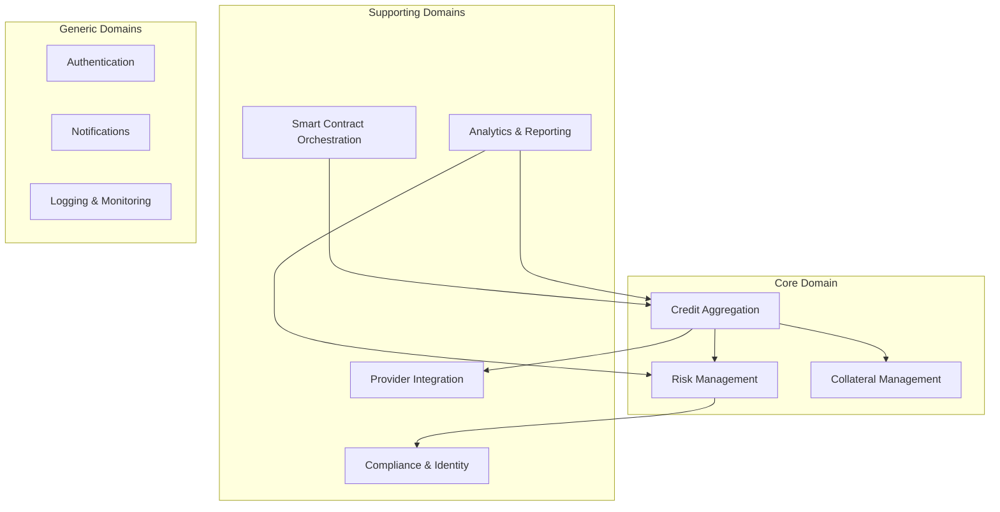
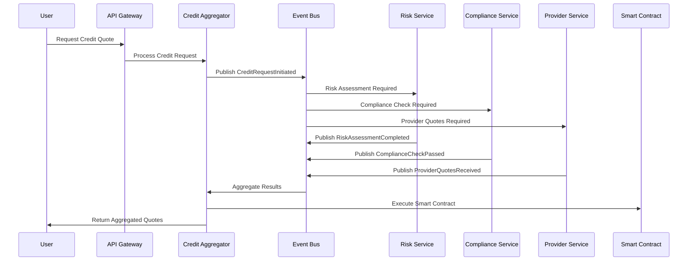
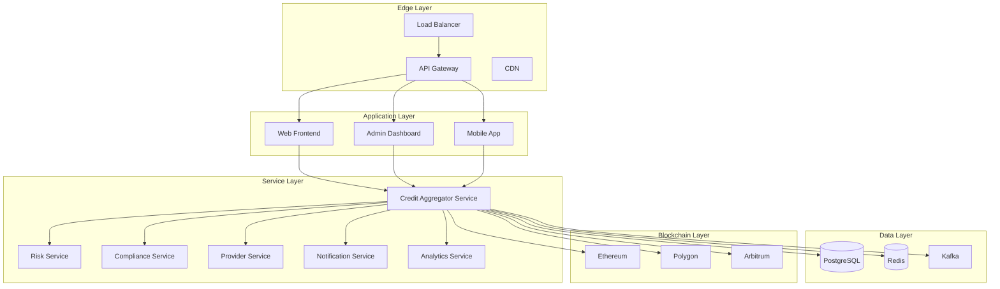
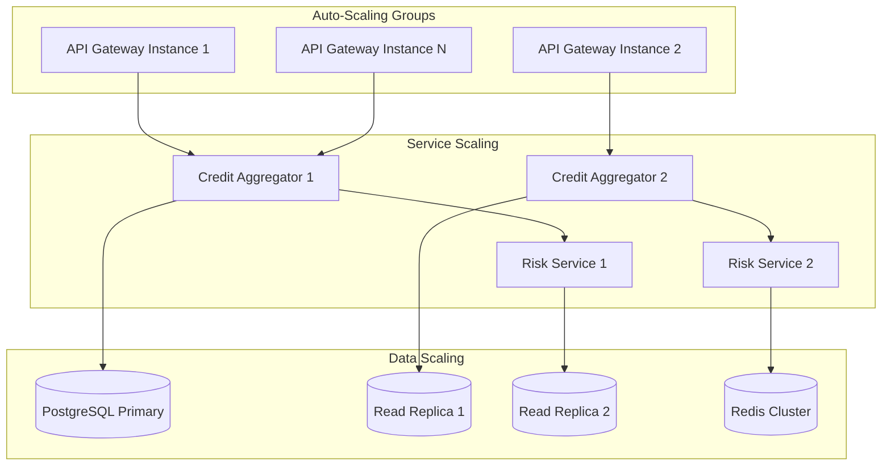
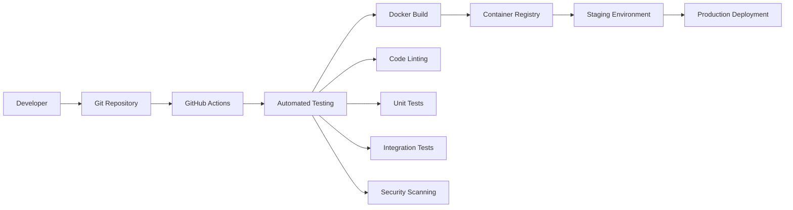
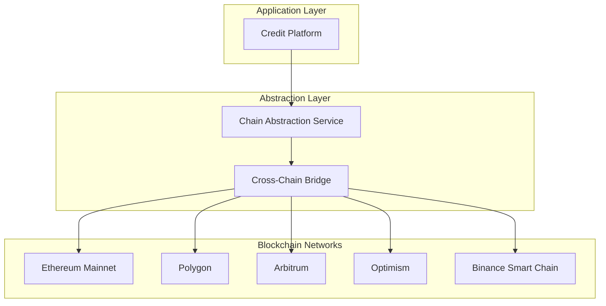

# Enterprise System Architecture

## Credit-as-a-Service Platform

### Executive Summary

This document outlines the enterprise-grade architecture for a scalable, compliant, and secure Credit-as-a-Service Platform that integrates traditional and DeFi lending providers through a unified interface.

## 1. Strategic & Technical Foundations

### 1.1 Domain-Driven Design (DDD) & Bounded Contexts



### 1.2 Event-Driven Architecture



### 1.3 Technology Stack

#### Frontend Stack (Current Implementation)

- **Next.js 14** with React 18 + TypeScript for type safety
- **Tailwind CSS** + **shadcn/ui** for consistent design system
- **Next.js build** for development and building (Vite planned as optional)
- **React Query** for server state management
- **Zustand** for client state management (used in provider dashboard)

#### Backend Stack (Current Implementation)

- **Node.js 20+** with TypeScript
- **Fastify** for high-performance API services (some services use Express)
- **REST APIs** (GraphQL with Apollo Server planned)
- **Drizzle ORM** for type-safe database access (Prisma planned)
- **Redis** for caching and sessions (Bull Queue planned)

#### Blockchain Stack

- **Solidity ^0.8.19** for smart contracts
- **Hardhat** for development and testing
- **OpenZeppelin** for security-audited libraries
- **Ethers.js v6** for blockchain interactions

#### Infrastructure Stack (Current Implementation)

- **PostgreSQL 15+** for primary database
- **Redis 7+** for caching and sessions
- **Docker + Docker Compose** for containerization (Kafka and Kubernetes planned)
- **Prometheus + Grafana** for monitoring
- **Structured logging** (ELK Stack planned)

## 2. Microservices Architecture

### 2.1 Service Breakdown



### 2.2 Service Specifications

#### Credit Aggregator Service

- **Purpose**: Core orchestration of credit requests and provider coordination
- **Responsibilities**:
  - Credit request processing
  - Provider quote aggregation
  - Smart contract interaction
  - User journey orchestration
- **API**: GraphQL + REST hybrid
- **Database**: PostgreSQL with read replicas
- **Events**: Publishes to Kafka for async processing

#### Risk Service

- **Purpose**: Credit risk assessment and scoring
- **Responsibilities**:
  - Credit score calculation
  - Risk model execution
  - Fraud detection
  - ML model inference
- **API**: gRPC for internal communication
- **Database**: PostgreSQL + Redis for model caching
- **ML Stack**: Python microservice for model serving

#### Compliance Service

- **Purpose**: KYC/AML and regulatory compliance
- **Responsibilities**:
  - Identity verification
  - AML screening
  - Regulatory reporting
  - Regional compliance rules
- **API**: REST with strict authentication
- **Database**: Encrypted PostgreSQL
- **Integrations**: Sumsub, Jumio, regulatory APIs

#### Provider Service

- **Purpose**: Integration with credit providers
- **Responsibilities**:
  - Provider adapter management
  - Quote retrieval and normalization
  - Provider health monitoring
  - Rate limiting and circuit breaking
- **API**: REST with provider-specific adapters
- **Database**: PostgreSQL for provider configs
- **Cache**: Redis for quote caching

## 3. Security & Compliance Framework

### 3.1 Security Architecture

```mermaid
graph TB
    subgraph "Security Layers"
        WAF[Web Application Firewall]
        AG[API Gateway with OAuth 2.0]
        RBAC[Role-Based Access Control]
        ENC[End-to-End Encryption]
        HSM[Hardware Security Module]
    end
    
    subgraph "Compliance Controls"
        KYC[KYC Verification]
        AML[AML Screening]
        GDPR[GDPR Compliance]
        SOC[SOC 2 Type II]
    end
    
    subgraph "Monitoring & Auditing"
        SIEM[Security Information Event Management]
        LOG[Centralized Logging]
        ALERT[Real-time Alerting]
        AUDIT[Audit Trail]
    end
    
    WAF --> AG
    AG --> RBAC
    RBAC --> ENC
    ENC --> HSM
    
    KYC --> AML
    AML --> GDPR
    GDPR --> SOC
    
    SIEM --> LOG
    LOG --> ALERT
    ALERT --> AUDIT
```



### 3.2 Compliance Requirements

#### Regulatory Compliance

- **Money Transmitter Licenses**: State-by-state compliance for US operations
- **Consumer Credit Laws**: Interest rate caps and disclosure requirements
- **GDPR**: EU data protection and privacy rights
- **PCI DSS**: Payment card industry security standards
- **SOX**: Financial reporting controls (if publicly traded)

#### Smart Contract Security

- **Multi-signature Wallets**: For administrative functions
- **Time-locked Upgrades**: 48-hour delay for critical changes
- **Circuit Breakers**: Automatic pause on anomalous activity
- **External Audits**: Quarterly security assessments
- **Bug Bounty Program**: Ongoing vulnerability discovery

### 3.3 Data Governance

#### Data Classification

- **Public**: Marketing materials, general documentation
- **Internal**: Business metrics, operational data
- **Confidential**: User PII, financial data
- **Restricted**: Compliance data, audit logs

#### Data Protection

- **Encryption at Rest**: AES-256 for all databases
- **Encryption in Transit**: TLS 1.3 for all communications
- **Key Management**: AWS KMS or HashiCorp Vault
- **Data Retention**: Automated purging per regulatory requirements

## 4. Scalability & Performance

### 4.1 Horizontal Scaling Strategy



### 4.2 Performance Optimization

#### Caching Strategy

- **L1 Cache**: Application-level caching (Node.js memory)
- **L2 Cache**: Redis for session and frequently accessed data
- **L3 Cache**: CDN for static assets and API responses
- **Cache Invalidation**: Event-driven cache updates

#### Database Optimization

- **Read Replicas**: Separate read and write operations
- **Connection Pooling**: PgBouncer for connection management
- **Query Optimization**: Automated query analysis and indexing
- **Partitioning**: Time-based partitioning for large tables

## 5. DevOps & Infrastructure

### 5.1 CI/CD Pipeline



### 5.2 Infrastructure as Code

#### Kubernetes Configuration

```yaml
# Example service configuration
apiVersion: apps/v1
kind: Deployment
metadata:
  name: credit-aggregator
spec:
  replicas: 3
  selector:
    matchLabels:
      app: credit-aggregator
  template:
    metadata:
      labels:
        app: credit-aggregator
    spec:
      containers:
      - name: credit-aggregator
        image: credit-platform/aggregator:latest
        ports:
        - containerPort: 3000
        env:
        - name: DATABASE_URL
          valueFrom:
            secretKeyRef:
              name: db-secret
              key: url
        resources:
          requests:
            memory: "256Mi"
            cpu: "250m"
          limits:
            memory: "512Mi"
            cpu: "500m"
```

### 5.3 Monitoring & Observability

#### Metrics & Monitoring

- **Application Metrics**: Custom business metrics (loan volume, approval rates)
- **Infrastructure Metrics**: CPU, memory, network, disk usage
- **Service Metrics**: Response times, error rates, throughput
- **Blockchain Metrics**: Gas usage, transaction success rates

#### Logging Strategy

- **Structured Logging**: JSON format with correlation IDs
- **Log Aggregation**: ELK Stack or similar
- **Log Retention**: 90 days for operational logs, 7 years for audit logs
- **Real-time Alerting**: PagerDuty for critical issues

## 6. Multi-Chain Strategy

### 6.1 Blockchain Integration



### 6.2 Cross-Chain Considerations

- **Asset Bridging**: LayerZero or Wormhole for cross-chain transfers
- **State Synchronization**: Event-based state updates across chains
- **Gas Optimization**: Dynamic chain selection based on fees
- **Liquidity Management**: Cross-chain liquidity pools

## 7. Implementation Roadmap

### Phase 1: MVP Foundation (Weeks 1-6) ✅ COMPLETED

- [x] Smart contract architecture
- [x] Basic microservices setup
- [x] Core API development
- [x] Simple provider integration
- [x] Basic risk assessment

### Phase 2: Enterprise Features (Weeks 7-12) 🔄 IN PROGRESS

- [x] Monitoring and observability (Prometheus + Grafana)
- [x] Basic security measures (JWT, rate limiting, encryption)
- [ ] Advanced compliance integration (Risk, Compliance services)
- [ ] Performance optimization (caching, query optimization)
- [x] Multi-provider support (credit-providers service)

### Phase 3: Scale & Expand (Weeks 13-18)

- [ ] Multi-chain deployment
- [ ] Advanced analytics
- [ ] Mobile application
- [ ] Global compliance
- [ ] Enterprise partnerships

### Phase 4: Advanced Features (Weeks 19-24)

- [ ] AI/ML risk models
- [ ] Cross-chain arbitrage
- [ ] Institutional APIs
- [ ] White-label solutions
- [ ] DAO governance

## 8. Success Metrics

### Technical KPIs

- **Uptime**: 99.9% availability SLA
- **Response Time**: <200ms for API calls
- **Throughput**: 10,000 concurrent users
- **Error Rate**: <0.1% for critical operations

### Business KPIs

- **Provider Integration**: 10+ providers by end of Phase 2
- **Transaction Volume**: $10M+ monthly by end of Phase 3
- **User Acquisition**: 100K+ registered users by end of Phase 4
- **Compliance**: Zero regulatory violations

This enterprise architecture provides a robust foundation for scaling the Credit-as-a-Service Platform from MVP to global deployment while maintaining security, compliance, and performance standards.

## 9. Implementation Gaps & Next Steps

### 9.1 Current Implementation Status

**✅ Implemented Components:**

- Smart contracts (CreditAggregator, CollateralManager, CreditScoringOracle)
- Frontend applications (Web, Admin, Provider dashboards)
- Core microservices (Auth, API Gateway, Notifications, Monitoring, etc.)
- Database schemas (Neon + Supabase dual architecture)
- Basic infrastructure (Docker Compose, monitoring)

**⚠️ Partial Implementation:**

- Event-driven architecture (WebSocket in notifications, no comprehensive event bus)
- Service mesh (API Gateway exists, but no full service mesh)
- Caching strategy (Redis implemented, but no L1/L2/L3 cache hierarchy)

**❌ Missing Components:**

- Risk Service (separate microservice)
- Compliance Service (KYC/AML microservice)
- Provider Service (consolidated provider management)
- Analytics Service (business intelligence)
- GraphQL API layer
- Apache Kafka event streaming
- Kubernetes orchestration
- Circuit breakers and resilience patterns
- Multi-chain bridge infrastructure

### 9.2 Immediate Next Steps (Phase 2 Completion)

#### Priority 1: Missing Core Services

```bash
# Create missing service directories
mkdir -p services/{risk-service,compliance-service,provider-service,analytics-service}
```

#### Priority 2: Technology Stack Gaps

- Implement GraphQL with Apollo Server
- Add Apache Kafka for event streaming
- Integrate Prisma alongside Drizzle ORM
- Add Bull Queue for job processing

#### Priority 3: Infrastructure Improvements

- Create Kubernetes manifests
- Add Helm charts for deployment
- Implement comprehensive CI/CD pipeline
- Add circuit breaker patterns to services

### 9.3 Phased Implementation Plan

**Phase 2A (Weeks 7-9): Core Services**

- [ ] Risk Service implementation
- [ ] Compliance Service implementation
- [ ] Provider Service consolidation
- [ ] Analytics Service foundation

**Phase 2B (Weeks 10-12): Technology Stack**

- [ ] GraphQL API layer
- [ ] Kafka event streaming
- [ ] Prisma integration
- [ ] Bull Queue implementation

**Phase 3 (Weeks 13-18): Infrastructure & Scale**

- [ ] Kubernetes deployment
- [ ] Multi-chain support
- [ ] Advanced monitoring
- [ ] Performance optimization

### 9.4 Success Metrics for Alignment

- **Service Completeness**: 100% of documented services implemented
- **Technology Stack**: 95% alignment with documented stack
- **Infrastructure**: Full Kubernetes deployment capability
- **Event Architecture**: Comprehensive event-driven patterns
- **Monitoring**: Full observability stack (ELK, Prometheus, Grafana)
