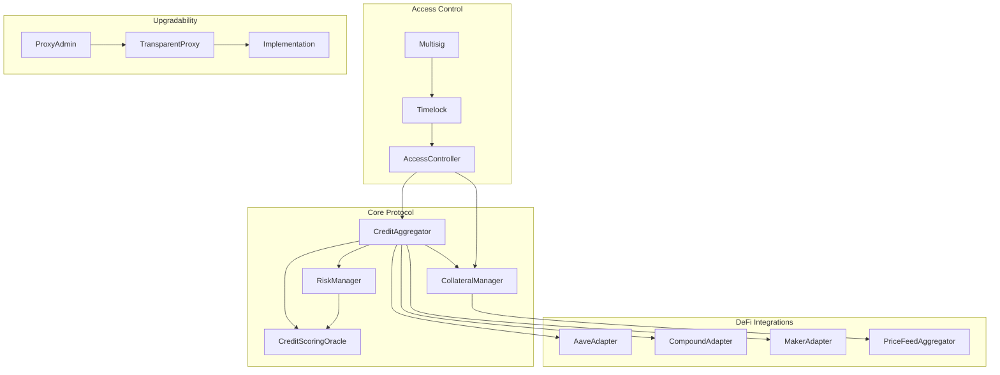

# Smart Contracts Architecture

## Overview

The Credit-as-a-Service Platform leverages smart contracts to enable decentralized credit aggregation, automated collateral management, and seamless integration with DeFi protocols. This document outlines the comprehensive architecture, design patterns, and implementation strategies for our smart contract ecosystem.

## 1. Contract Architecture Overview

### Core Contract Relationships and Interactions



### Inheritance Hierarchy and Interfaces

```solidity
// Core Interfaces
interface ICreditAggregator {
    function requestCredit(uint256 amount, address collateral, uint256 collateralAmount) external returns (uint256 creditId);
    function repayCredit(uint256 creditId, uint256 amount) external;
    function liquidate(uint256 creditId) external;
}

interface ICollateralManager {
    function depositCollateral(address token, uint256 amount) external;
    function withdrawCollateral(address token, uint256 amount) external;
    function getCollateralValue(address user) external view returns (uint256);
}

interface ICreditScoringOracle {
    function getCreditScore(address user) external view returns (uint256);
    function updateCreditScore(address user, uint256 score) external;
}

// Abstract Base Contracts
abstract contract CreditProtocolBase is Ownable, Pausable, ReentrancyGuard {
    // Common functionality for all protocol contracts
}

abstract contract DeFiAdapterBase {
    // Common adapter functionality
}
```

### Protocol Integration Points

- **External Protocol Adapters**: Standardized interfaces for integrating with lending protocols
- **Oracle Integration**: Chainlink price feeds and custom credit scoring oracles
- **Cross-chain Bridge**: LayerZero/Wormhole integration for multi-chain credit portability
- **Keeper Networks**: Chainlink Keepers for automated liquidations and maintenance

## 2. Core Contracts

### CreditAggregator.sol Design and Responsibilities

```solidity
contract CreditAggregator is CreditProtocolBase, ICreditAggregator {
    
    struct CreditPosition {
        address borrower;
        uint256 principal;
        uint256 interestRate;
        uint256 collateralAmount;
        address collateralToken;
        uint256 startTime;
        uint256 duration;
        CreditStatus status;
        address lendingProtocol;
    }
    
    enum CreditStatus {
        Active,
        Repaid,
        Defaulted,
        Liquidated
    }
    
    mapping(uint256 => CreditPosition) public creditPositions;
    mapping(address => uint256[]) public userCredits;
    mapping(address => uint256) public protocolWeights;
    
    uint256 private _creditIdCounter;
    ICollateralManager public collateralManager;
    ICreditScoringOracle public creditScoringOracle;
    IRiskManager public riskManager;
    
    event CreditRequested(uint256 indexed creditId, address indexed borrower, uint256 amount);
    event CreditRepaid(uint256 indexed creditId, uint256 amount);
    event CreditLiquidated(uint256 indexed creditId, address indexed liquidator);
    
    // Core responsibilities:
    // 1. Aggregate credit offers from multiple protocols
    // 2. Route credit requests to optimal lending sources
    // 3. Manage credit lifecycle (creation, repayment, liquidation)
    // 4. Calculate and distribute interest payments
    // 5. Emit events for off-chain indexing
    
    function requestCredit(
        uint256 amount,
        address collateral,
        uint256 collateralAmount,
        uint256 duration
    ) external override returns (uint256 creditId) {
        require(amount > 0, "Invalid amount");
        require(duration > 0, "Invalid duration");
        
        // Verify credit score and risk assessment
        uint256 creditScore = creditScoringOracle.calculateCreditScore(msg.sender);
        require(creditScore >= riskManager.getMinimumCreditScore(), "Insufficient credit score");
        
        // Lock collateral
        collateralManager.lockCollateral(msg.sender, collateral, collateralAmount);
        
        // Find optimal lending protocol
        address optimalProtocol = _findOptimalProtocol(amount, duration);
        uint256 interestRate = _calculateInterestRate(msg.sender, amount, creditScore);
        
        creditId = ++_creditIdCounter;
        
        creditPositions[creditId] = CreditPosition({
            borrower: msg.sender,
            principal: amount,
            interestRate: interestRate,
            collateralAmount: collateralAmount,
            collateralToken: collateral,
            startTime: block.timestamp,
            duration: duration,
            status: CreditStatus.Active,
            lendingProtocol: optimalProtocol
        });
        
        userCredits[msg.sender].push(creditId);
        
        emit CreditRequested(creditId, msg.sender, amount);
        
        return creditId;
    }
    
    function repayCredit(uint256 creditId, uint256 amount) external override {
        CreditPosition storage position = creditPositions[creditId];
        require(position.borrower == msg.sender, "Not borrower");
        require(position.status == CreditStatus.Active, "Credit not active");
        
        uint256 totalOwed = _calculateTotalOwed(creditId);
        require(amount >= totalOwed, "Insufficient repayment amount");
        
        // Process repayment
        position.status = CreditStatus.Repaid;
        
        // Release collateral
        collateralManager.releaseCollateral(
            msg.sender, 
            position.collateralToken, 
            position.collateralAmount
        );
        
        // Update credit score
        creditScoringOracle.updateCreditMetrics(
            msg.sender, 
            CreditUpdateType.OnTimePayment, 
            amount
        );
        
        emit CreditRepaid(creditId, amount);
    }
    
    function liquidate(uint256 creditId) external override {
        CreditPosition storage position = creditPositions[creditId];
        require(position.status == CreditStatus.Active, "Credit not active");
        require(_isLiquidatable(creditId), "Position not liquidatable");
        
        position.status = CreditStatus.Liquidated;
        
        // Execute liquidation through collateral manager
        collateralManager.liquidateCollateral(
            position.borrower,
            position.collateralToken,
            position.collateralAmount,
            msg.sender
        );
        
        // Update credit score negatively
        creditScoringOracle.updateCreditMetrics(
            position.borrower,
            CreditUpdateType.Default,
            position.principal
        );
        
        emit CreditLiquidated(creditId, msg.sender);
    }
    
    function _findOptimalProtocol(uint256 amount, uint256 duration) internal view returns (address) {
        // Implementation for finding optimal lending protocol
        // Based on interest rates, liquidity, and protocol weights
    }
    
    function _calculateInterestRate(address borrower, uint256 amount, uint256 creditScore) internal view returns (uint256) {
        // Dynamic interest rate calculation based on credit score and market conditions
    }
    
    function _calculateTotalOwed(uint256 creditId) internal view returns (uint256) {
        // Calculate principal + accrued interest
    }
    
    function _isLiquidatable(uint256 creditId) internal view returns (bool) {
        // Check if position is eligible for liquidation
    }
}

### CollateralManager.sol Implementation

```solidity
contract CollateralManager is CreditProtocolBase, ICollateralManager {
    
    struct CollateralInfo {
        address token;
        uint256 amount;
        uint256 lockedAmount;
        uint256 lastUpdateTime;
    }
    
    mapping(address => mapping(address => CollateralInfo)) public userCollateral;
    mapping(address => bool) public supportedCollateral;
    mapping(address => uint256) public collateralFactors; // LTV ratios (basis points)
    mapping(address => uint256) public liquidationThresholds;
    
    IPriceFeedAggregator public priceFeed;
    uint256 public constant BASIS_POINTS = 10000;
    
    event CollateralDeposited(address indexed user, address indexed token, uint256 amount);
    event CollateralWithdrawn(address indexed user, address indexed token, uint256 amount);
    event CollateralLocked(address indexed user, address indexed token, uint256 amount);
    event CollateralReleased(address indexed user, address indexed token, uint256 amount);
    event CollateralLiquidated(address indexed borrower, address indexed token, uint256 amount, address liquidator);
    
    // Key features:
    // 1. Multi-token collateral support
    // 2. Dynamic collateral factor adjustment
    // 3. Automated collateral rebalancing
    // 4. Flash loan protection
    // 5. Collateral swap functionality
    
    function depositCollateral(address token, uint256 amount) external override nonReentrant {
        require(supportedCollateral[token], "Unsupported collateral");
        require(amount > 0, "Invalid amount");
        
        IERC20(token).safeTransferFrom(msg.sender, address(this), amount);
        
        CollateralInfo storage info = userCollateral[msg.sender][token];
        info.token = token;
        info.amount += amount;
        info.lastUpdateTime = block.timestamp;
        
        emit CollateralDeposited(msg.sender, token, amount);
    }
    
    function withdrawCollateral(address token, uint256 amount) external override nonReentrant {
        CollateralInfo storage info = userCollateral[msg.sender][token];
        require(info.amount >= amount, "Insufficient balance");
        require(info.amount - info.lockedAmount >= amount, "Amount locked");
        
        info.amount -= amount;
        info.lastUpdateTime = block.timestamp;
        
        IERC20(token).safeTransfer(msg.sender, amount);
        
        emit CollateralWithdrawn(msg.sender, token, amount);
    }
    
    function lockCollateral(address user, address token, uint256 amount) external onlyAuthorized {
        CollateralInfo storage info = userCollateral[user][token];
        require(info.amount >= info.lockedAmount + amount, "Insufficient collateral");
        
        info.lockedAmount += amount;
        info.lastUpdateTime = block.timestamp;
        
        emit CollateralLocked(user, token, amount);
    }
    
    function releaseCollateral(address user, address token, uint256 amount) external onlyAuthorized {
        CollateralInfo storage info = userCollateral[user][token];
        require(info.lockedAmount >= amount, "Invalid release amount");
        
        info.lockedAmount -= amount;
        info.lastUpdateTime = block.timestamp;
        
        emit CollateralReleased(user, token, amount);
    }
    
    function getCollateralValue(address user) external view override returns (uint256 totalValue) {
        // Calculate total USD value of user's collateral
        address[] memory tokens = getSupportedTokens();
        
        for (uint256 i = 0; i < tokens.length; i++) {
            address token = tokens[i];
            CollateralInfo memory info = userCollateral[user][token];
            
            if (info.amount > 0) {
                uint256 price = priceFeed.getPrice(token);
                uint256 tokenValue = (info.amount * price) / (10 ** IERC20Metadata(token).decimals());
                totalValue += tokenValue;
            }
        }
    }
    
    function getAvailableCollateral(address user, address token) external view returns (uint256) {
        CollateralInfo memory info = userCollateral[user][token];
        return info.amount - info.lockedAmount;
    }
    
    function liquidateCollateral(
        address borrower,
        address token,
        uint256 amount,
        address liquidator
    ) external onlyAuthorized {
        CollateralInfo storage info = userCollateral[borrower][token];
        require(info.lockedAmount >= amount, "Insufficient locked collateral");
        
        info.amount -= amount;
        info.lockedAmount -= amount;
        info.lastUpdateTime = block.timestamp;
        
        // Transfer collateral to liquidator with liquidation bonus
        uint256 liquidationBonus = (amount * 500) / BASIS_POINTS; // 5% bonus
        IERC20(token).safeTransfer(liquidator, amount + liquidationBonus);
        
        emit CollateralLiquidated(borrower, token, amount, liquidator);
    }
    
    function swapCollateral(
        address fromToken,
        address toToken,
        uint256 amount,
        uint256 minAmountOut
    ) external nonReentrant {
        require(supportedCollateral[fromToken] && supportedCollateral[toToken], "Unsupported tokens");
        
        CollateralInfo storage fromInfo = userCollateral[msg.sender][fromToken];
        require(fromInfo.amount - fromInfo.lockedAmount >= amount, "Insufficient available collateral");
        
        // Execute swap through DEX integration
        uint256 amountOut = _executeSwap(fromToken, toToken, amount, minAmountOut);
        
        // Update collateral balances
        fromInfo.amount -= amount;
        userCollateral[msg.sender][toToken].amount += amountOut;
        
        fromInfo.lastUpdateTime = block.timestamp;
        userCollateral[msg.sender][toToken].lastUpdateTime = block.timestamp;
    }
    
    function _executeSwap(
        address fromToken,
        address toToken,
        uint256 amount,
        uint256 minAmountOut
    ) internal returns (uint256 amountOut) {
        // Implementation for DEX integration (Uniswap V3, etc.)
    }
    
    function getSupportedTokens() public view returns (address[] memory) {
        // Return array of supported collateral tokens
    }
}

### CreditScoringOracle.sol Implementation

```solidity
interface ICreditScoringOracle {
    struct CreditData {
        uint256 score;           // 0-1000 scale
        uint256 totalBorrowed;
        uint256 totalRepaid;
        uint256 defaultCount;
        uint256 onTimePayments;
        uint256 utilizationRate;
        uint256 lastUpdateBlock;
    }
    
    enum CreditUpdateType {
        OnTimePayment,
        LatePayment,
        Default,
        NewBorrow,
        Repayment
    }
    
    function getCreditData(address user) external view returns (CreditData memory);
    function updateCreditMetrics(address user, CreditUpdateType updateType, uint256 value) external;
    function calculateCreditScore(address user) external view returns (uint256);
}

contract CreditScoringOracle is ICreditScoringOracle, Ownable {
    mapping(address => CreditData) public creditHistory;
    mapping(address => bool) public authorizedUpdaters;
    mapping(address => uint256) public userFirstBorrowTime;
    
    uint256 public constant MAX_SCORE = 1000;
    uint256 public constant MIN_SCORE = 100;
    uint256 public constant INITIAL_SCORE = 500;
    
    event CreditScoreUpdated(address indexed user, uint256 oldScore, uint256 newScore);
    event CreditMetricsUpdated(address indexed user, CreditUpdateType updateType, uint256 value);
    
    modifier onlyAuthorizedUpdater() {
        require(authorizedUpdaters[msg.sender], "Not authorized");
        _;
    }
    
    // Scoring algorithm implementation
    // Integration with off-chain data providers
    // Historical data aggregation
    
    function getCreditData(address user) external view override returns (CreditData memory) {
        return creditHistory[user];
    }
    
    function updateCreditMetrics(
        address user,
        CreditUpdateType updateType,
        uint256 value
    ) external override onlyAuthorizedUpdater {
        CreditData storage data = creditHistory[user];
        
        // Initialize if first interaction
        if (data.lastUpdateBlock == 0) {
            data.score = INITIAL_SCORE;
            userFirstBorrowTime[user] = block.timestamp;
        }
        
        uint256 oldScore = data.score;
        
        if (updateType == CreditUpdateType.OnTimePayment) {
            data.onTimePayments++;
            data.totalRepaid += value;
            _increaseScore(data, 10); // +10 points for on-time payment
        } else if (updateType == CreditUpdateType.LatePayment) {
            data.totalRepaid += value;
            _decreaseScore(data, 20); // -20 points for late payment
        } else if (updateType == CreditUpdateType.Default) {
            data.defaultCount++;
            _decreaseScore(data, 100); // -100 points for default
        } else if (updateType == CreditUpdateType.NewBorrow) {
            data.totalBorrowed += value;
            _updateUtilizationRate(user, data);
        } else if (updateType == CreditUpdateType.Repayment) {
            data.totalRepaid += value;
            _updateUtilizationRate(user, data);
        }
        
        data.lastUpdateBlock = block.number;
        
        // Recalculate comprehensive score
        data.score = calculateCreditScore(user);
        
        emit CreditMetricsUpdated(user, updateType, value);
        emit CreditScoreUpdated(user, oldScore, data.score);
    }
    
    function calculateCreditScore(address user) public view override returns (uint256) {
        CreditData memory data = creditHistory[user];
        
        if (data.lastUpdateBlock == 0) {
            return INITIAL_SCORE;
        }
        
        uint256 score = INITIAL_SCORE;
        
        // Payment history (40% weight)
        if (data.onTimePayments + data.defaultCount > 0) {
            uint256 paymentRatio = (data.onTimePayments * 100) / (data.onTimePayments + data.defaultCount);
            score += (paymentRatio * 400) / 100;
        }
        
        // Credit utilization (30% weight)
        if (data.utilizationRate <= 30) {
            score += 300; // Full points for low utilization
        } else if (data.utilizationRate <= 70) {
            score += 300 - ((data.utilizationRate - 30) * 300) / 40;
        }
        // No points for high utilization
        
        // Credit history length (15% weight)
        uint256 historyMonths = (block.timestamp - userFirstBorrowTime[user]) / 30 days;
        if (historyMonths > 0) {
            uint256 historyScore = historyMonths > 24 ? 150 : (historyMonths * 150) / 24;
            score += historyScore;
        }
        
        // Total borrowed amount (10% weight) - rewards larger borrowers
        if (data.totalBorrowed > 0) {
            uint256 borrowScore = data.totalBorrowed > 100000e18 ? 100 : (data.totalBorrowed * 100) / 100000e18;
            score += borrowScore;
        }
        
        // Default penalty (5% weight)
        if (data.defaultCount > 0) {
            uint256 defaultPenalty = data.defaultCount * 50;
            score = score > defaultPenalty ? score - defaultPenalty : MIN_SCORE;
        }
        
        // Ensure score is within bounds
        if (score > MAX_SCORE) score = MAX_SCORE;
        if (score < MIN_SCORE) score = MIN_SCORE;
        
        return score;
    }
    
    function _increaseScore(CreditData storage data, uint256 points) internal {
        data.score = data.score + points > MAX_SCORE ? MAX_SCORE : data.score + points;
    }
    
    function _decreaseScore(CreditData storage data, uint256 points) internal {
        data.score = data.score > points ? data.score - points : MIN_SCORE;
    }
    
    function _updateUtilizationRate(address user, CreditData storage data) internal {
        // Calculate current utilization based on active positions
        // This would integrate with the CreditAggregator to get current debt
    }
    
    function addAuthorizedUpdater(address updater) external onlyOwner {
        authorizedUpdaters[updater] = true;
    }
    
    function removeAuthorizedUpdater(address updater) external onlyOwner {
        authorizedUpdaters[updater] = false;
    }
    
    function batchUpdateScores(address[] calldata users) external onlyOwner {
        for (uint256 i = 0; i < users.length; i++) {
            uint256 oldScore = creditHistory[users[i]].score;
            uint256 newScore = calculateCreditScore(users[i]);
            creditHistory[users[i]].score = newScore;
            emit CreditScoreUpdated(users[i], oldScore, newScore);
        }
    }
}
