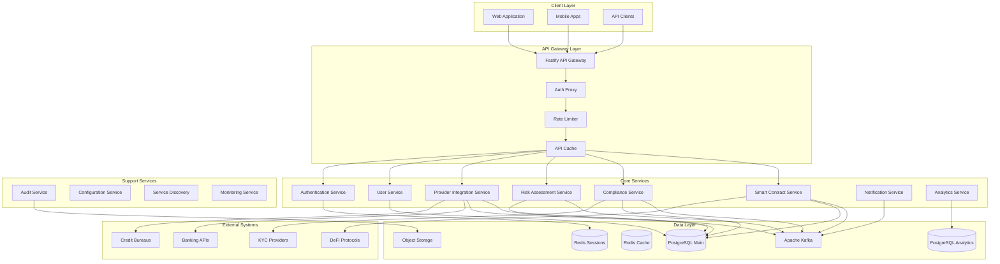
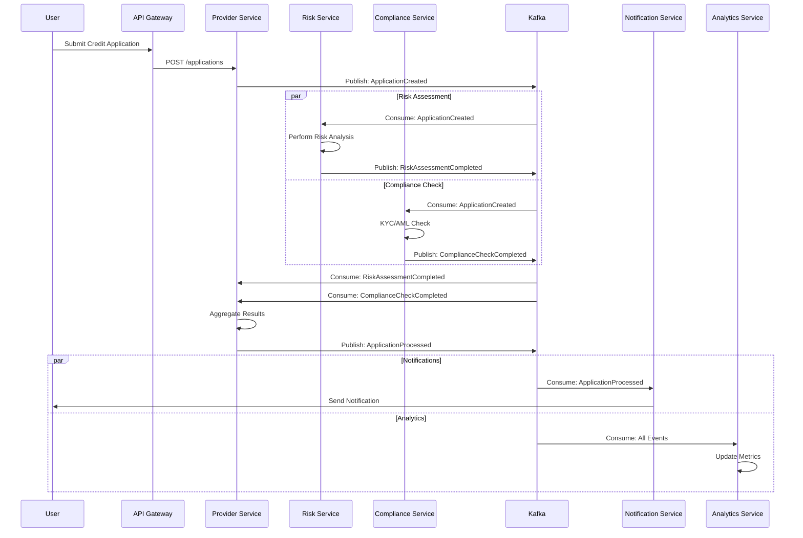
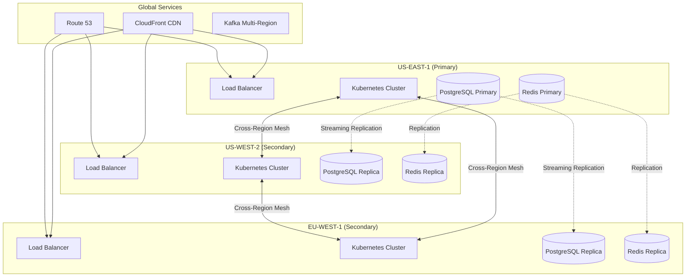

# System Architecture

## Overview

The Credit-as-a-Service Platform adopts a microservices architecture pattern with event-driven communication, ensuring scalability, maintainability, and fault tolerance. The system is designed to handle high-throughput credit processing while maintaining strict security and compliance requirements.

## Architecture Principles

### Core Design Principles

1. **Domain-Driven Design (DDD)**: Each microservice represents a bounded context
2. **Event Sourcing**: Critical business events are stored as immutable facts
3. **CQRS Pattern**: Separation of command and query responsibilities
4. **API-First Design**: All services expose well-defined APIs
5. **Cloud-Native**: Built for containerized, distributed environments
6. **Security by Design**: Zero-trust architecture with defense in depth
7. **Contract Standardization**: Shared endpoint and event contracts across services (`docs/api/service-standards.md`, `docs/api/event-contracts.md`)

## Microservices Layout



## Service Communication Patterns

### Synchronous Communication

```yaml
# REST API Communication
- Protocol: HTTP/2 with TLS 1.3
- Format: JSON (primary), Protocol Buffers (internal)
- Patterns:
  - Request/Response
  - Circuit Breaker
  - Retry with Exponential Backoff
  - Timeout Management

# GraphQL Communication
- Protocol: HTTP/2
- Use Cases:
  - Mobile BFF (Backend for Frontend)
  - Complex data aggregation
  - Real-time subscriptions
```

### Asynchronous Communication

```yaml
# Event-Driven Architecture
- Message Broker: Apache Kafka
- Patterns:
  - Publish/Subscribe
  - Event Sourcing
  - Saga Pattern for distributed transactions
  - Dead Letter Queue for failed messages

# Event Categories:
  - Domain Events: CreditApplicationCreated, RiskAssessmentCompleted
  - Integration Events: ProviderDataReceived, ComplianceCheckPassed
  - System Events: ServiceHealthCheck, ConfigurationUpdated
```

## Event-Driven Architecture

### Event Flow Diagram



### Event Schema

```typescript
// Base Event Interface
interface DomainEvent {
  eventId: string;
  eventType: string;
  aggregateId: string;
  aggregateType: string;
  eventVersion: number;
  eventTimestamp: Date;
  metadata: EventMetadata;
  payload: Record<string, any>;
}

interface EventMetadata {
  correlationId: string;
  causationId: string;
  userId?: string;
  tenantId?: string;
  source: string;
}

// Example: Credit Application Created Event
interface CreditApplicationCreatedEvent extends DomainEvent {
  eventType: 'CreditApplicationCreated';
  aggregateType: 'CreditApplication';
  payload: {
    applicationId: string;
    userId: string;
    requestedAmount: number;
    currency: string;
    purpose: string;
    providers: string[];
    createdAt: Date;
  };
}
```

## Service Mesh Configuration

### Istio Service Mesh

```yaml
# Service Mesh Features
- Traffic Management:
  - Load Balancing (Round Robin, Least Request, Random)
  - Circuit Breaking
  - Retry Logic
  - Timeout Configuration
  - Fault Injection for testing

- Security:
  - mTLS between services
  - Authorization policies
  - JWT validation
  - Rate limiting per service

- Observability:
  - Distributed tracing (Jaeger)
  - Metrics collection (Prometheus)
  - Service dependency visualization (Kiali)
  - Access logs

# Example Virtual Service Configuration
apiVersion: networking.istio.io/v1beta1
kind: VirtualService
metadata:
  name: provider-service
spec:
  hosts:
  - provider-service
  http:
  - match:
    - headers:
        x-version:
          exact: v2
    route:
    - destination:
        host: provider-service
        subset: v2
      weight: 100
  - route:
    - destination:
        host: provider-service
        subset: v1
      weight: 90
    - destination:
        host: provider-service
        subset: v2
      weight: 10
    timeout: 30s
    retries:
      attempts: 3
      perTryTimeout: 10s
```

## API Gateway Configuration

### Kong API Gateway Setup

```yaml
# Kong Configuration
services:
  - name: provider-integration-service
    url: http://provider-service.default.svc.cluster.local:8080
    routes:
      - name: provider-routes
        paths:
          - /api/v1/providers
          - /api/v1/applications
        methods:
          - GET
          - POST
          - PUT
          - DELETE
    plugins:
      - name: jwt
        config:
          key_claim_name: kid
          claims_to_verify:
            - exp
            - nbf
      - name: rate-limiting
        config:
          minute: 100
          hour: 10000
          policy: local
      - name: request-transformer
        config:
          add:
            headers:
              - X-Service-Name:provider-integration
      - name: response-transformer
        config:
          add:
            headers:
              - X-Response-Time:$(latency)
      - name: prometheus
        config:
          per_consumer: true

# API Gateway Routing Rules
routes:
  # Public APIs
  - path: /api/v1/auth/*
    service: authentication-service
    public: true
    
  # Protected APIs
  - path: /api/v1/users/*
    service: user-service
    auth: required
    
  - path: /api/v1/credit/*
    service: provider-integration-service
    auth: required
    
  - path: /api/v1/risk/*
    service: risk-assessment-service
    auth: required
    roles: [user, admin]
    
  - path: /api/v1/compliance/*
    service: compliance-service
    auth: required
    roles: [compliance-officer, admin]
    
  - path: /api/v1/contracts/*
    service: smart-contract-service
    auth: required
    
  # Admin APIs
  - path: /api/v1/admin/*
    service: admin-service
    auth: required
    roles: [admin]
```

## Service Discovery & Configuration

### Consul Service Discovery

```yaml
# Service Registration
services:
  - id: provider-service-1
    name: provider-service
    tags:
      - primary
      - v1.2.0
    port: 8080
    check:
      http: http://localhost:8080/health
      interval: 10s
      timeout: 5s
    meta:
      version: 1.2.0
      protocols: http,grpc
      
# Configuration Management
config:
  provider-service:
    database:
      host: ${DB_HOST}
      port: 5432
      name: provider_db
      pool_size: 20
    redis:
      host: ${REDIS_HOST}
      port: 6379
      db: 0
    kafka:
      brokers: ${KAFKA_BROKERS}
      consumer_group: provider-service-group
    features:
      risk_v2_enabled: true
      compliance_async: true
```

## Resilience Patterns

### Circuit Breaker Configuration

```typescript
// Circuit Breaker Implementation
class CircuitBreaker {
  private state: 'CLOSED' | 'OPEN' | 'HALF_OPEN' = 'CLOSED';
  private failureCount = 0;
  private successCount = 0;
  private lastFailureTime?: Date;
  
  constructor(
    private threshold = 5,
    private timeout = 60000, // 1 minute
    private halfOpenRequests = 3
  ) {}
  
  async execute<T>(operation: () => Promise<T>): Promise<T> {
    if (this.state === 'OPEN') {
      if (Date.now() - this.lastFailureTime!.getTime() > this.timeout) {
        this.state = 'HALF_OPEN';
        this.successCount = 0;
      } else {
        throw new Error('Circuit breaker is OPEN');
      }
    }
    
    try {
      const result = await operation();
      this.onSuccess();
      return result;
    } catch (error) {
      this.onFailure();
      throw error;
    }
  }
  
  private onSuccess() {
    this.failureCount = 0;
    if (this.state === 'HALF_OPEN') {
      this.successCount++;
      if (this.successCount >= this.halfOpenRequests) {
        this.state = 'CLOSED';
      }
    }
  }
  
  private onFailure() {
    this.failureCount++;
    this.lastFailureTime = new Date();
    if (this.failureCount >= this.threshold) {
      this.state = 'OPEN';
    }
  }
}
```

### Retry Strategy

```typescript
// Exponential Backoff Retry
class RetryStrategy {
  constructor(
    private maxAttempts = 3,
    private initialDelay = 1000,
    private maxDelay = 30000,
    private multiplier = 2
  ) {}
  
  async execute<T>(
    operation: () => Promise<T>,
    shouldRetry: (error: any) => boolean = () => true
  ): Promise<T> {
    let lastError: any;
    
    for (let attempt = 0; attempt < this.maxAttempts; attempt++) {
      try {
        return await operation();
      } catch (error) {
        lastError = error;
        
        if (!shouldRetry(error) || attempt === this.maxAttempts - 1) {
          throw error;
        }
        
        const delay = Math.min(
          this.initialDelay * Math.pow(this.multiplier, attempt),
          this.maxDelay
        );
        
        await new Promise(resolve => setTimeout(resolve, delay));
      }
    }
    
    throw lastError;
  }
}
```

## Distributed Tracing

### OpenTelemetry Configuration

```typescript
// Tracing Setup
import { NodeTracerProvider } from '@opentelemetry/sdk-trace-node';
import { JaegerExporter } from '@opentelemetry/exporter-jaeger';
import { BatchSpanProcessor } from '@opentelemetry/sdk-trace-base';

const provider = new NodeTracerProvider({
  resource: {
    attributes: {
      'service.name': process.env.SERVICE_NAME,
      'service.version': process.env.SERVICE_VERSION,
      'deployment.environment': process.env.ENVIRONMENT,
    },
  },
});

const jaegerExporter = new JaegerExporter({
  endpoint: process.env.JAEGER_ENDPOINT || 'http://jaeger:14268/api/traces',
});

provider.addSpanProcessor(new BatchSpanProcessor(jaegerExporter));
provider.register();

// Trace Context Propagation
interface TraceContext {
  traceId: string;
  spanId: string;
  traceFlags: number;
  traceState?: string;
}

// Example traced operation
async function tracedOperation(context: TraceContext, operation: string) {
  const span = tracer.startSpan(operation, {
    parent: context,
    attributes: {
      'operation.type': 'database',
      'db.system': 'postgresql',
    },
  });
  
  try {
    const result = await performOperation();
    span.setStatus({ code: SpanStatusCode.OK });
    return result;
  } catch (error) {
    span.recordException(error);
    span.setStatus({ code: SpanStatusCode.ERROR });
    throw error;
  } finally {
    span.end();
  }
}
```

## Health Checks & Monitoring

### Service Health Check Implementation

```typescript
// Health Check Endpoint
interface HealthCheckResult {
  status: 'healthy' | 'unhealthy' | 'degraded';
  version: string;
  uptime: number;
  timestamp: Date;
  checks: {
    [key: string]: {
      status: 'pass' | 'fail' | 'warn';
      componentType: string;
      observedValue?: any;
      observedUnit?: string;
      time: Date;
      output?: string;
    };
  };
}

class HealthCheckService {
  async checkHealth(): Promise<HealthCheckResult> {
    const checks = await Promise.all([
      this.checkDatabase(),
      this.checkRedis(),
      this.checkKafka(),
      this.checkDependentServices(),
    ]);
    
    const overallStatus = this.determineOverallStatus(checks);
    
    return {
      status: overallStatus,
      version: process.env.SERVICE_VERSION!,
      uptime: process.uptime(),
      timestamp: new Date(),
      checks: this.formatChecks(checks),
    };
  }
  
  private async checkDatabase(): Promise<ComponentCheck> {
    try {
      const start = Date.now();
      await db.query('SELECT 1');
      const latency = Date.now() - start;
      
      return {
        name: 'database',
        status: latency < 100 ? 'pass' : 'warn',
        componentType: 'datastore',
        observedValue: latency,
        observedUnit: 'ms',
        time: new Date(),
      };
    } catch (error) {
      return {
        name: 'database',
        status: 'fail',
        componentType: 'datastore',
        time: new Date(),
        output: error.message,
      };
    }
  }
}
```

## Deployment Topology

### Multi-Region Architecture



## Performance Optimization

### Caching Strategy

```yaml
# Multi-Level Cache Architecture
caching:
  levels:
    - name: "Browser Cache"
      ttl: 3600
      headers:
        - Cache-Control: public, max-age=3600
        - ETag: enabled
      
    - name: "CDN Cache"
      ttl: 86400
      invalidation:
        - API: POST /api/cache/invalidate
        - Events: ContentUpdated, DeploymentCompleted
      
    - name: "API Gateway Cache"
      ttl: 300
      key_pattern: "${method}:${path}:${query}:${headers.authorization}"
      bypass:
        - Headers: Cache-Control=no-cache
        - Methods: POST, PUT, DELETE
      
    - name: "Application Cache (Redis)"
      ttl: 600
      patterns:
        - User sessions: user:${userId}:session
        - API responses: api:${endpoint}:${params}
        - Computed data: computed:${type}:${id}
      
    - name: "Database Query Cache"
      ttl: 60
      strategies:
        - Read-through
        - Write-through
        - Cache-aside
```

### Connection Pooling

```typescript
// Database Connection Pool Configuration
const poolConfig = {
  // PostgreSQL Pool
  database: {
    min: 10,
    max: 50,
    acquireTimeoutMillis: 30000,
    createTimeoutMillis: 30000,
    destroyTimeoutMillis: 5000,
    idleTimeoutMillis: 30000,
    reapIntervalMillis: 1000,
    createRetryIntervalMillis: 100,
  },
  
  // Redis Pool
  redis: {
    min: 5,
    max: 30,
    acquireTimeoutMillis: 10000,
    destroyTimeoutMillis: 5000,
    idleTimeoutMillis: 30000,
  },
  
  // HTTP Connection Pool
  http: {
    maxSockets: 100,
    maxFreeSockets: 10,
    timeout: 60000,
    keepAliveTimeout: 30000,
  },
};
```

## Security Architecture Integration

### Zero Trust Security Model

```yaml
security:
  principles:
    - "Never trust, always verify"
    - "Least privilege access"
    - "Assume breach"
    
  implementation:
    network:
      - mTLS between all services
      - Network policies for pod-to-pod communication
      - Egress filtering and monitoring
      
    identity:
      - Service identity via SPIFFE/SPIRE
      - Workload attestation
      - Short-lived certificates (24h rotation)
      
    access:
      - RBAC for service-to-service communication
      - OPA (Open Policy Agent) for fine-grained authorization
      - API key rotation every 30 days
      
    monitoring:
      - All access logged and analyzed
      - Anomaly detection via ML
      - Real-time security dashboards
```

## Disaster Recovery

### RTO/RPO Targets

```yaml
disaster_recovery:
  targets:
    rto: 4 hours  # Recovery Time Objective
    rpo: 1 hour   # Recovery Point Objective
    
  strategies:
    data:
      - Continuous replication to DR region
      - Point-in-time recovery for databases
      - Automated backup verification
      
    services:
      - Blue-green deployment capability
      - Automated failover via health checks
      - Cross-region service mesh
      
    testing:
      - Monthly DR drills
      - Chaos engineering tests
      - Automated recovery procedures
```

## Monitoring & Alerting

### Observability Stack

```yaml
monitoring:
  metrics:
    - collector: Prometheus
      interval: 15s
      retention: 30d
      
  logs:
    - aggregator: Elasticsearch
      retention: 90d
      indexing: daily
      
  traces:
    - backend: Jaeger
      sampling: 0.1%
      retention: 7d
      
  alerting:
    - manager: AlertManager
      channels:
        - PagerDuty (critical)
        - Slack (warnings)
        - Email (info)
      
  dashboards:
    - platform: Grafana
      templates:
        - Service Overview
        - Business Metrics
        - SLA Compliance
        - Security Events
```

## Next Steps

1. Review and implement [Microservices Specification](./microservices-specification.md)
2. Set up development environment following the patterns defined here
3. Configure monitoring and observability stack
4. Implement service mesh for production deployment
5. Establish CI/CD pipelines for each microservice
